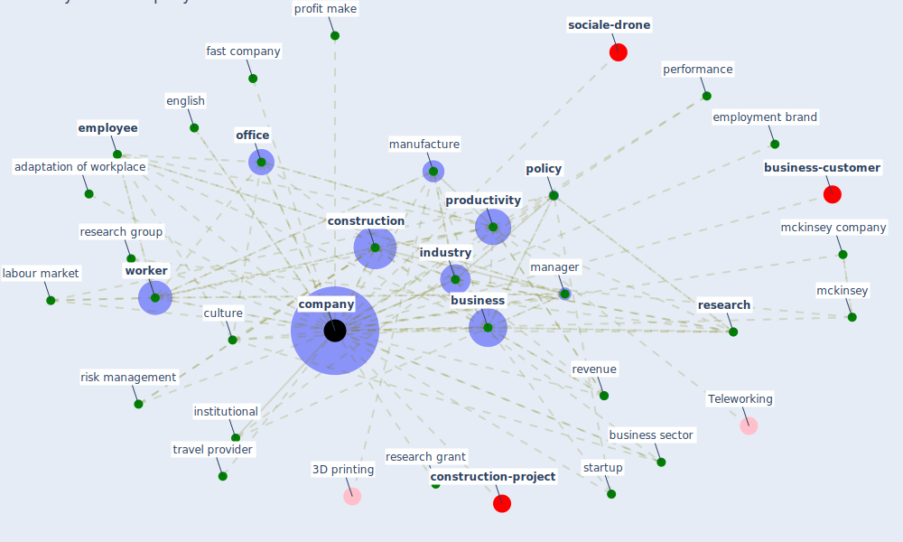

# Keyword: company

* [construction-project](cluster_6)

* [business-customer](cluster_8)

* [sociale-drone](cluster_11)

## Keywords

 * 152 mckinsey, Cluster_11, Cluster_6, Cluster_8, adaptation of workplace, apple, belgium, [build](keyword_build), [business](keyword_business), business activity, business sector, [company](keyword_company), competitiveness, [construction](keyword_construction), construction company, corporate tone, [covid 19 pandemic](keyword_covid_19_pandemic), culture, [danish](keyword_danish), datum processing, [employee](keyword_employee), employment brand, english, [entrepreneur](keyword_entrepreneur), fast, fast company, finance, fortune 500, headquarter, health sector, human resource, [industry](keyword_industry), industry level, institutional, [labour market](keyword_labour_market), [management](keyword_management), [manager](keyword_manager), [manufacture](keyword_manufacture), mckinsey, mckinsey and company, mckinsey company, metric, nadca, [office](keyword_office), order, performance, pet, [policy](keyword_policy), private corporation, [productivity](keyword_productivity), profit and loss, profit make, [research](keyword_research), research grant, research group, restructure, revenue, risk management, sectoral, [society](keyword_society), societé anonyme, société anonyme, [startup](keyword_startup), train their worker, [travel](keyword_travel), travel provider, wearable register, work environment, work organisation, [worker](keyword_worker)

## Mapping

## Neighbours

### Closest articles

* Sustainable work throughout the life course: National policies and strategies, Publications Office of the European Union - [LINK](article_eurofund_sustainable_2016)
* It’s time to reimagine where and how work will get done (PwC’s US Remote Work Survey) - [LINK](article_pricewaterhousecoopers_its_2021)
* Supporting Technologies for COVID-19 Prevention: Systemized Review - [LINK](article_zhao_supporting_2022)
* A study on office workplace modification during the COVID-19 pandemic in The Netherlands - [LINK](article_hou_study_2021)
* Pandemic Analytics: How Countries are Leveraging Big Data Analytics and Artificial Intelligence to Fight COVID-19? - [LINK](article_mehta_pandemic_2021)
* Health, Wellbeing \& Productivity in Offices - [LINK](article_world_green_building_council_health_2014)
* Guidelines for Responding to COVID-19 Pandemic: Best Practices, Impacts, and Future Research Directions - [LINK](article_assaad_guidelines_2021)
* Mechanisms for addressing the impact of COVID-19 on infrastructure projects - [LINK](article_king_mechanisms_2021)
* How COVID-19 Could Accelerate the Adoption of New Retail Technologies and Enhance the (E-)Servicescape - [LINK](article_willems_how_2021)
* Case Study on Finnish TVETA Resilient Model of Training During COVID-19 - [LINK](article_unesco_case_2021)

### Closest BPs

