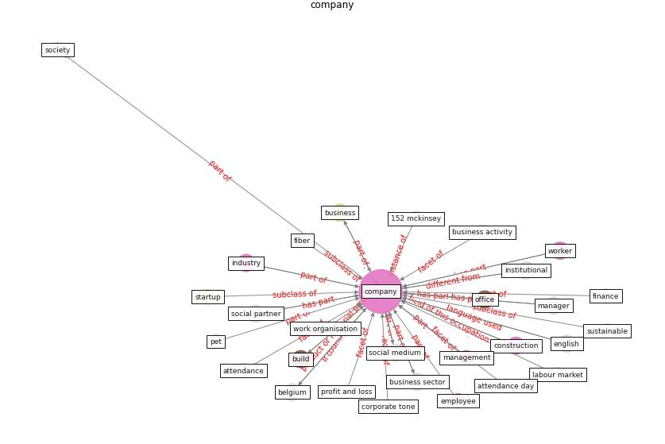

# Keyword: __company__
## Clusters

* Cluster 3: [construction-project](cluster_3)

## Concepts

 

## Top 10 articles for __company__
* eurofund_sustainable_2016 ([eurofund_sustainable_2016](article_eurofund_sustainable_2016))
* pricewaterhousecoopers_its_2021 ([pricewaterhousecoopers_its_2021](article_pricewaterhousecoopers_its_2021))
* Supporting Technologies for COVID-19 Prevention:
Systemized Review ([zhao_supporting_2022](article_zhao_supporting_2022))
* realdania_refleksioner_2022_EN ([realdania_refleksioner_2022_EN](article_realdania_refleksioner_2022_EN))
* A study on office workplace modification during the
COVID-19 pandemic in The Netherlands ([hou_study_2021](article_hou_study_2021))
* world_green_building_council_health_2014 ([world_green_building_council_health_2014](article_world_green_building_council_health_2014))
* Pandemic Analytics: How Countries are Leveraging
Big Data Analytics and Artificial Intelligence to
Fight COVID-19? ([mehta_pandemic_2021](article_mehta_pandemic_2021))
* Mechanisms for addressing the impact of COVID-19 on
infrastructure projects ([king_mechanisms_2021](article_king_mechanisms_2021))
* Guidelines for Responding to COVID-19 Pandemic:
Best Practices, Impacts, and Future Research
Directions ([assaad_guidelines_2021](article_assaad_guidelines_2021))
* unesco_case_2021 ([unesco_case_2021](article_unesco_case_2021))
