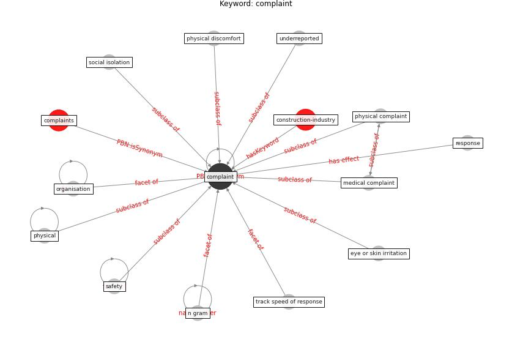

# Keyword: complaint

* [construction-industry](cluster_Cluster_3)

## Keywords

 * Cluster_3, [complaint](keyword_complaint), complaints, eye or skin irritation, medical complaint, n gram, [organisation](keyword_organisation), [physical](keyword_physical), physical complaint, physical discomfort, response, [safety](keyword_safety), social isolation, track speed of response, underreported

## Concepts

 

## Neighbours

### Closest articles

* Health, Wellbeing \& Productivity in Offices - [LINK](article_world_green_building_council_health_2014)
* Analysis of COVID-19 Concerns Raised by the Construction Workforce and Development of Mitigation Practices - [LINK](article_bou_hatoum_analysis_2021)
* Prophylactic Architecture: Formulating the Concept of Pandemic-Resilient Homes - [LINK](article_elrayies_prophylactic_2022)
* Ventilation use in nonmedical settings during COVID-19: Cleaning protocol, maintenance, and recommendations - [LINK](article_nembhard_ventilation_2020)

### Closest BPs

