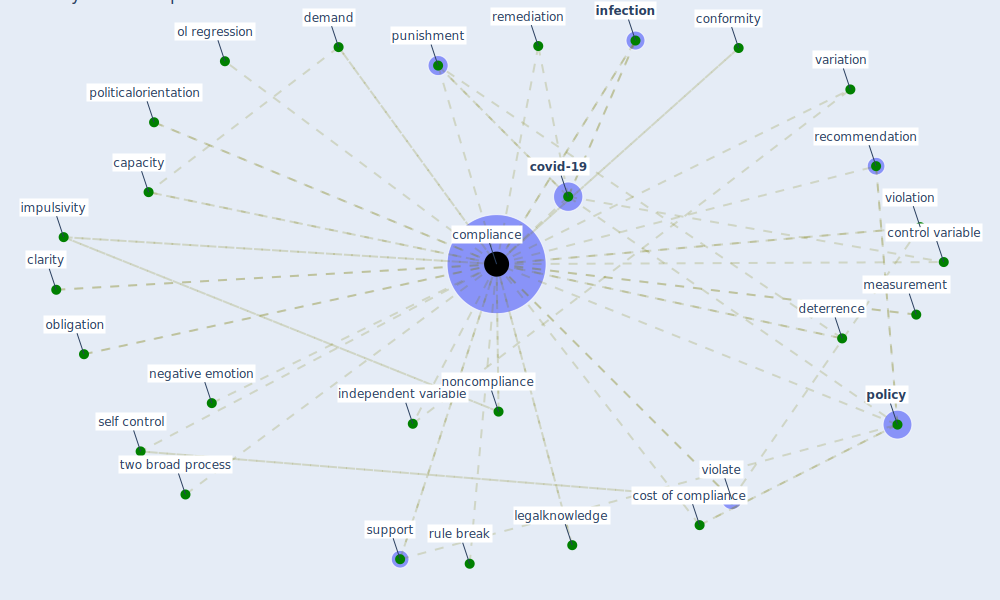

# Keyword: compliance

## Keywords

 * behavior, [bsi](keyword_bsi), capacity, certainty of punishment, clarity, [compliance](keyword_compliance), conformity, control variable, cost of compliance, [covid-19](keyword_covid-19), demand, [deterrence](keyword_deterrence), deterrent effect, educate, educate the public, emotion, explain variance, [factor](keyword_factor), feldman and teichman, generally support, [ieq](keyword_ieq), impulsivity, independent variable, indicative, [infection](keyword_infection), legalknowledge, [management](keyword_management), measurement, mitigate the virus, [mitigation](keyword_mitigation), mitigation policy, mitigation strategy, [monitor](keyword_monitor), negative emotion, non normative ool, noncompliance, obligation, obligation to obey authority, ol regression, [parameter](keyword_parameter), [policy](keyword_policy), politicalorientation, practicablycapacity, practicablycapacity to obey the rule, process, punishment, r0, recommendation, remediation, research on this, rule break, self control, self report, stringency, subjective self interest, super visory approach, support, two broad process, two裸broad process, variation, violate, violation

## Mapping

## Neighbours

### Closest articles

* Compliance with COVID-19 Mitigation Measures in the United States - [LINK](article_van_rooij_compliance_2020)
* The Intelligent Lockdown: Compliance with COVID-19 Mitigation Measures in the Netherlands - [LINK](article_kuiper_intelligent_2020)
* Mitigation strategies and compliance in the COVID-19 fight; how much compliance is enough? - [LINK](article_mukerjee_mitigation_2021)
* Continuous IEQ monitoring system: Context and development - [LINK](article_parkinson_continuous_2019)
* COVID-19 Bulletin 1: Alterations to BREEAM assessment requirements as a result of the Coronavirus pandemic – Knowledge Base - [LINK](article_breeam_covid-19_2020)
* An Intelligent IEQ Monitoring and Feedback System: Development and Applications - [LINK](article_geng_intelligent_2021)
* COVID19-Routes: A Safe Pedestrian Navigation Service - [LINK](article_cantarero_covid19-routes_2021)
* Mechanisms for addressing the impact of COVID-19 on infrastructure projects - [LINK](article_king_mechanisms_2021)
* World Bank Development Report - [LINK](article_world_bank_world_2022)

### Closest BPs

