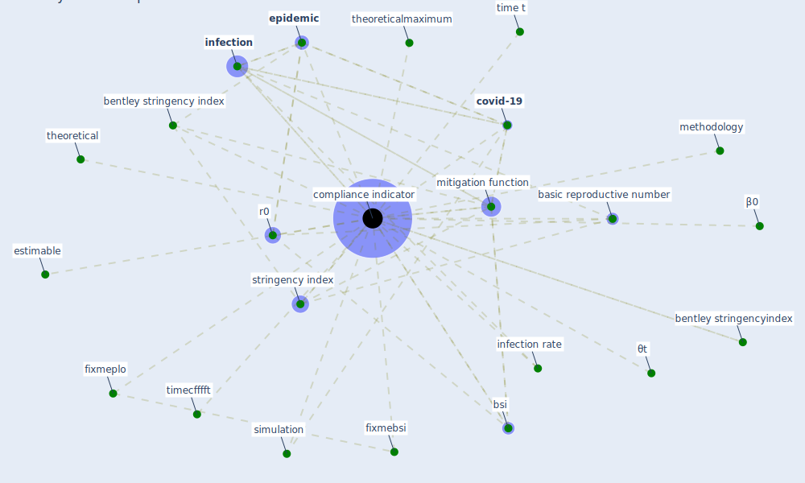

# Keyword: compliance indicator

## Keywords

 * basic reproductive number, bentley stringency index, bentley stringencyindex, [bsi](keyword_bsi), [compliance indicator](keyword_compliance_indicator), [covid-19](keyword_covid-19), [epidemic](keyword_epidemic), estimable, fixmebsi, fixmeplo, [infection](keyword_infection), infection rate, methodology, mitigation function, r0, [simulation](keyword_simulation), stringency index, theoretical, theoreticalmaximum, time t, timecfffft, β0, θt

## Mapping

## Neighbours

### Closest articles

* Mitigation strategies and compliance in the COVID-19 fight; how much compliance is enough? - [LINK](article_mukerjee_mitigation_2021)

### Closest BPs

