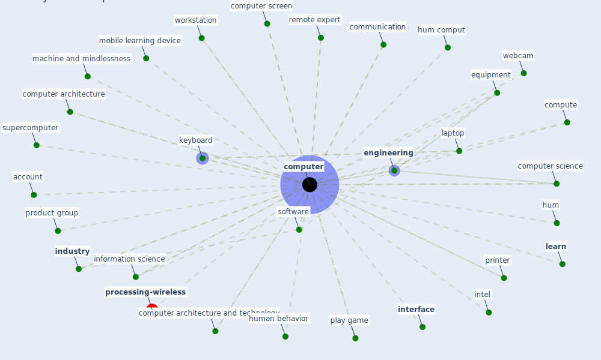

# Keyword: computer

* [processing-wireless](cluster_14)

## Keywords

 * Cluster_14, account, board, button, communication, compute, [computer](keyword_computer), computer architecture, computer architecture and technology, computer mouse, computer science, computer screen, computers, [datum](keyword_datum), datum processing center, [desk](keyword_desk), [disinfect](keyword_disinfect), [education](keyword_education), electronic device and technology, [engineering](keyword_engineering), [environment](keyword_environment), equipment, game, hum, hum comput, human behavior, [industry](keyword_industry), information science, intel, [interface](keyword_interface), keyboard, laptop, [learn](keyword_learn), learn device, logist, machine and mindlessness, matlab, mobile learning device, mouse, operation, operation research, play game, printer, product group, program, remote expert, scientific datum, sensor nod, [service](keyword_service), [simulation](keyword_simulation), smart board, [smart ieq](keyword_smart_ieq), [smartphone](keyword_smartphone), [society](keyword_society), software, supercomputer, [technology](keyword_technology), vacuum cleaner, washer and dryer, webcam, [workstation](keyword_workstation)

## Mapping

## Neighbours

### Closest articles

* How COVID-19 Could Accelerate the Adoption of New Retail Technologies and Enhance the (E-)Servicescape - [LINK](article_willems_how_2021)
* The effect of occupant distribution on energy consumption and COVID-19 infection in buildings: A case study of university building - [LINK](article_mokhtari_effect_2021)
* Leveraging Digital Transformation Technologies to Tackle COVID-19: Proposing a Privacy-First Holistic Framework - [LINK](article_arpaci_leveraging_2021)
* COVID19-Routes: A Safe Pedestrian Navigation Service - [LINK](article_cantarero_covid19-routes_2021)
* Future (post-COVID) digital, smart and sustainable cities in the wake of 6G: Digital twins, immersive realities and new urban economies - [LINK](article_allam_future_2021)
* Social distancing enhanced automated optimal design of physical spaces in the wake of the COVID-19 pandemic - [LINK](article_ugail_social_2021)
* Scalable IoT Architecture for Monitoring IEQ Conditions in Public and Private Buildings - [LINK](article_calvo_scalable_2022)
* Addressing the impact of COVID-19 lockdown on energy use in municipal buildings: A case study in Florianópolis, Brazil - [LINK](article_geraldi_addressing_2021)
* Designing a Multi-Agent Occupant Simulation System to Support Facility Planning and Analysis for COVID-19 - [LINK](article_lee_designing_2021)
* Construction of a Linked Data Set of COVID-19 Knowledge Graphs: Development and Applications - [LINK](article_wang_construction_2022)

### Closest BPs

