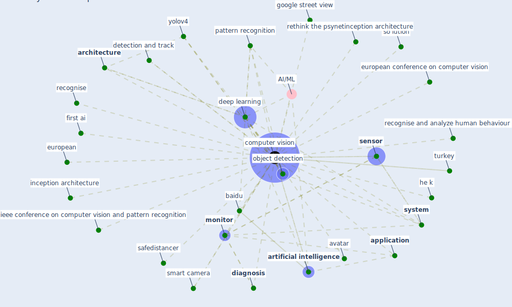

# Keyword: computer vision

## Keywords

 * AI/ML, [application](keyword_application), [architecture](keyword_architecture), [artificial intelligence](keyword_artificial_intelligence), avatar, baidu, [computer vision](keyword_computer_vision), [deep learning](keyword_deep_learning), detection and track, [diagnosis](keyword_diagnosis), european, european conference on computer vision, first ai, google street view, he k, ieee conference on computer vision and pattern recognition, inception architecture, [monitor](keyword_monitor), [object detection](keyword_object_detection), pattern recognition, recognise, recognise and analyze human behaviour, rethink the psynetinception architecture, safedistancer, [sensor](keyword_sensor), smart camera, so lution, [system](keyword_system), turkey, yolov4

## Mapping

## Neighbours

### Closest articles

* DeepSOCIAL: Social Distancing Monitoring and Infection Risk Assessment in COVID-19 Pandemic - [LINK](article_rezaei_deepsocial_2020)
* Towards the sustainable development of smart cities through mass video surveillance: A response to the COVID-19 pandemic - [LINK](article_shorfuzzaman_towards_2021)
*  - [LINK](article_huy-tran_design_2022)
* Pandemic Analytics: How Countries are Leveraging Big Data Analytics and Artificial Intelligence to Fight COVID-19? - [LINK](article_mehta_pandemic_2021)
* Ten questions concerning occupant health in buildings during normal operations and extreme events including the COVID-19 pandemic - [LINK](article_awada_ten_2021)
* A Comprehensive Review of the COVID-19 Pandemic and the Role of IoT, Drones, AI, Blockchain, and 5G in Managing its Impact - [LINK](article_chamola_comprehensive_2020)
* Designing a Multi-Agent Occupant Simulation System to Support Facility Planning and Analysis for COVID-19 - [LINK](article_lee_designing_2021)
* Construction of a Linked Data Set of COVID-19 Knowledge Graphs: Development and Applications - [LINK](article_wang_construction_2022)
* How COVID-19 Could Accelerate the Adoption of New Retail Technologies and Enhance the (E-)Servicescape - [LINK](article_willems_how_2021)

### Closest BPs

