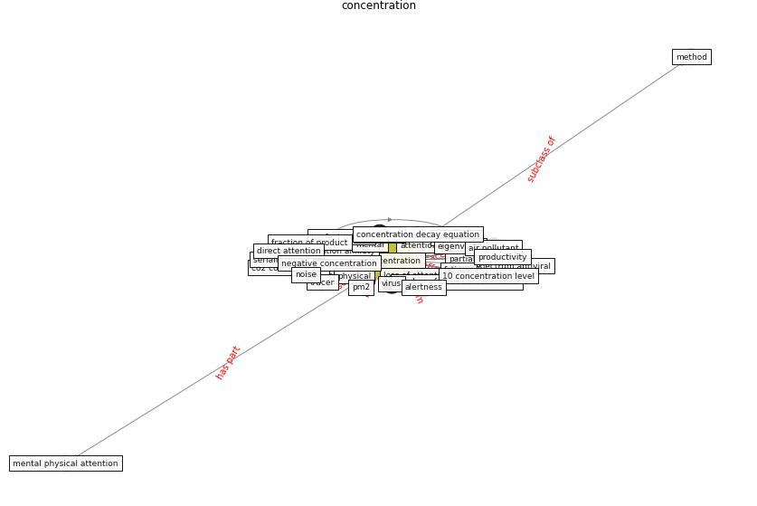

# Keyword: __concentration__
## Clusters

* Cluster 4: [air-formaldehyde](cluster_4.md)

## Concepts

 

## Articles
* Occupant health in buildings: Impact of the COVID-19
pandemic on the opinions of building professionals and
implications on research ([awada_occupant_2022](article_awada_occupant_2022.md))
* The Effect of Opening Windows on Air Change
Rates in Two Homes ([howard-reed_effect_2002](article_howard-reed_effect_2002.md))
* Occupant health in buildings: Impact of the COVID-19
pandemic on the opinions of building professionals and
implications on research ([awada_occupant_2022](article_awada_occupant_2022.md))
* Methods for air cleaning and protection of building
occupants from airborne pathogens ([bolashikov_methods_2009](article_bolashikov_methods_2009.md))
* Characterization and performance evaluation of a
full-scale activated carbon-based dynamic botanical air
filtration system for improving indoor air quality ([wang_characterization_2011](article_wang_characterization_2011.md))
* Graphene-based nanomaterials as antimicrobial surface
coatings: A parallel approach to restrain the expansion
of COVID-19 ([ayub_graphene-based_2021](article_ayub_graphene-based_2021.md))
* Ten questions concerning occupant health in buildings
during normal operations and extreme events including the
COVID-19 pandemic ([awada_ten_2021](article_awada_ten_2021.md))
* world_green_building_council_health_2014-700 ([world_green_building_council_health_2014-700](article_world_green_building_council_health_2014-700.md))
* Assessment method for new sustainability indicators
providing pandemic resilience for residential buildings ([tokazhanov_assessment_2021](article_tokazhanov_assessment_2021.md))
* Global value chains: Efficiency and risks in the context
of COVID-19 ([oecd_global_2021](article_oecd_global_2021.md))
