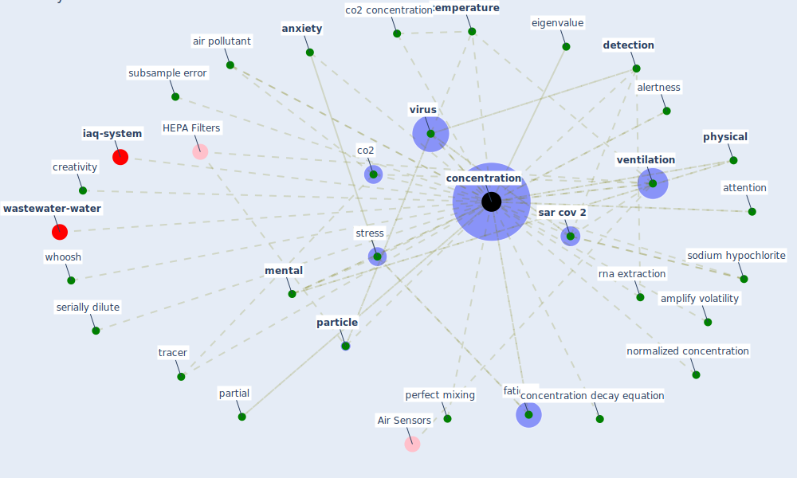

# Keyword: concentration

* [wastewater-water](cluster_0)

* [iaq-system](cluster_3)

## Keywords

 * 10 concentration level, Cluster_0, Cluster_3, [air change rate](keyword_air_change_rate), [air pollutant](keyword_air_pollutant), alertness, amplify volatility, [anxiety](keyword_anxiety), attention, background level, broad spectrum antiviral, co2, co2 concentration, [concentration](keyword_concentration), concentration anxiety, concentration decay equation, concentrations, creative interaction, creativity, decay rate, [depression](keyword_depression), [detection](keyword_detection), detection limit, direct attention, eigenvalue, fatigue, fraction of product, glutardialdehyde, loss of attention, [mental](keyword_mental), [method](keyword_method), mind, negative concentration, [noise](keyword_noise), normalize, normalized concentration, number of virus concentration, partial, [particle](keyword_particle), particle size, perfect mixing, [physical](keyword_physical), pm2, [pollution](keyword_pollution), [productivity](keyword_productivity), [rna](keyword_rna), rna extraction, [sar cov 2](keyword_sar_cov_2), serially dilute, sodium hypochlorite, [stress](keyword_stress), subsample error, [temperature](keyword_temperature), topic density, tracer, ultrafiltration, [ventilation](keyword_ventilation), [virus](keyword_virus), volatility, whoosh

## Mapping

## Neighbours

### Closest articles

* Occupant health in buildings: Impact of the COVID-19 pandemic on the opinions of building professionals and implications on research - [LINK](article_awada_occupant_2022)
* Health, Wellbeing \& Productivity in Offices - [LINK](article_world_green_building_council_health_2014)
* The Effect of Opening Windows on Air Change Rates in Two Homes - [LINK](article_howard-reed_effect_2002)
* Methods for air cleaning and protection of building occupants from airborne pathogens - [LINK](article_bolashikov_methods_2009)
* How our homes impact our health: using a COVID-19 informed approach to examine urban apartment housing - [LINK](article_peters_how_2020)
* Global value chains: Efficiency and risks in the context of COVID-19 - [LINK](article_oecd_global_2021)
* Assessment method for new sustainability indicators providing pandemic resilience for residential buildings - [LINK](article_tokazhanov_assessment_2021)
* Ten questions concerning occupant health in buildings during normal operations and extreme events including the COVID-19 pandemic - [LINK](article_awada_ten_2021)
* Characterization and performance evaluation of a full-scale activated carbon-based dynamic botanical air filtration system for improving indoor air quality - [LINK](article_wang_characterization_2011)
* First confirmed detection of SARS-CoV-2 in untreated wastewater in Australia: A proof of concept for the wastewater surveillance of COVID-19 in the community - [LINK](article_ahmed_first_2020)

### Closest BPs

