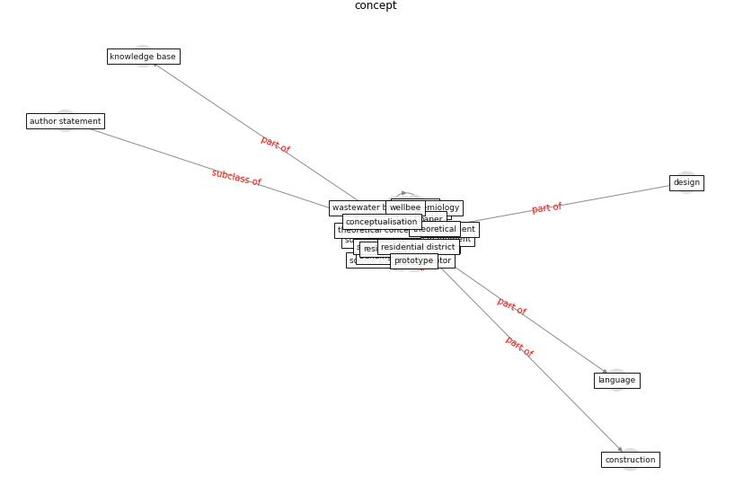

# Keyword: __concept__
## Clusters

* Cluster 4: [smart-city](cluster_4)

## Concepts

 

## Top 10 articles for __concept__
* Biophilic design in architecture and its contributions to
health, well-being, and sustainability: A critical
review ([zhong_biophilic_2022](article_zhong_biophilic_2022))
* Effects of the COVID-19 pandemic on the use and
perceptions of urban green space: An international
exploratory study ([ugolini_effects_2020](article_ugolini_effects_2020))
* A review of definitions and measures of system
resilience ([hosseini_review_2016](article_hosseini_review_2016))
* Design COVID-19 Ontology: A Healthcare and
Safety Perspective ([aloulou_design_2022](article_aloulou_design_2022))
* How the 5G Enabled the COVID-19 Pandemic
Prevention and Control: Materiality, Affordance,
and (De-)Spatialization ([li_how_2022](article_li_how_2022))
* COVID19-Routes: A Safe Pedestrian Navigation
Service ([cantarero_covid19-routes_2021](article_cantarero_covid19-routes_2021))
* How COVID-19 Could Accelerate the Adoption of
New Retail Technologies and Enhance the
(E-)Servicescape ([willems_how_2021](article_willems_how_2021))
* eurofund_sustainable_2016 ([eurofund_sustainable_2016](article_eurofund_sustainable_2016))
* Emerging Technologies to Combat the COVID-19
Pandemic ([vaishya_emerging_2020](article_vaishya_emerging_2020))
* The Emergence of Anti-Privacy and Control at the
Nexus between the Concepts of Safe City and Smart
City ([allam_emergence_2019](article_allam_emergence_2019))
