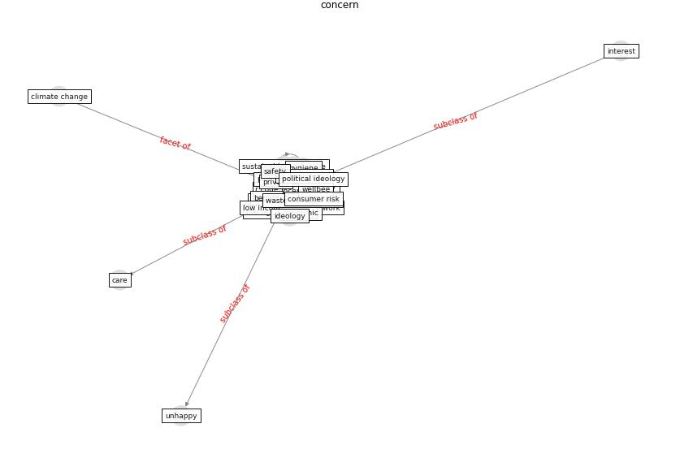

# Keyword: __concern__
## Clusters

* Cluster 4: [smart-city](cluster_4)

## Concepts

 

## Top 10 articles for __concern__
* How COVID-19 Could Accelerate the Adoption of
New Retail Technologies and Enhance the
(E-)Servicescape ([willems_how_2021](article_willems_how_2021))
* Exploring the Non-Medical impacts of Covid-19 using
Natural Language Processing ([agade_exploring_2020](article_agade_exploring_2020))
* Eviction, Health Inequity, and the Spread of
COVID-19: Housing Policy as a Primary Pandemic
Mitigation Strategy ([benfer_eviction_2021](article_benfer_eviction_2021))
* Response to COVID-19 in Taiwan: Big Data
Analytics, New Technology, and Proactive
Testing ([wang_response_2020](article_wang_response_2020))
* Psychological Effects of Home Confinement and
Social Distancing Derived from COVID-19 in the
General Population—A Systematic Review ([rodriguez-fernandez_psychological_2021](article_rodriguez-fernandez_psychological_2021))
* eurofund_sustainable_2016 ([eurofund_sustainable_2016](article_eurofund_sustainable_2016))
* oecd_guidelines_2014 ([oecd_guidelines_2014](article_oecd_guidelines_2014))
* martin_impact_2008 ([martin_impact_2008](article_martin_impact_2008))
* world_bank_world_2022 ([world_bank_world_2022](article_world_bank_world_2022))
* Should I Stay or Should I Go? Tourists’
COVID-19 Risk Perception and Vacation Behavior
Shift ([bratic_should_2021](article_bratic_should_2021))
