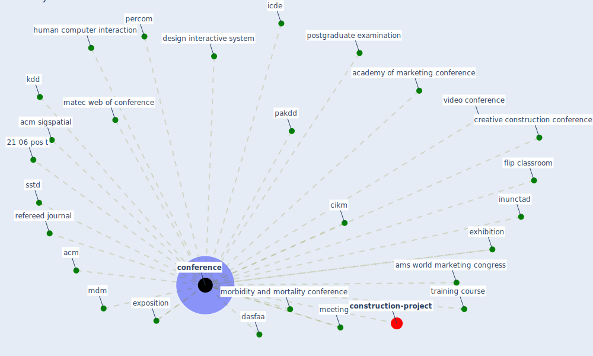

# Keyword: conference

* [construction-project](cluster_8)

## Keywords

 * 21 06 pos t, Cluster_8, academy of marketing conference, acm, acm sigspatial, ams world marketing congress, cikm, [conference](keyword_conference), conferences, creative construction conference, dasfaa, design interactive system, exhibition, exposition, flip classroom, human computer interaction, icde, inunctad, kdd, matec web of conference, mdm, meeting, morbidity and mortality conference, pakdd, percom, postgraduate examination, refereed journal, sstd, training course, video conference, vldb

## Mapping

## Neighbours

### Closest articles

* Impacts of COVID-19 on Health and Safety of Workforce in Construction Industry - [LINK](article_pamidimukkala_impacts_2021)
* Impact of COVID-19 on IoT Adoption in Healthcare, Smart Homes, Smart Buildings, Smart Cities, Transportation and Industrial IoT - [LINK](article_umair_impact_2021)
* Urban planning after COVID-19 - [LINK](article_rtpi_urban_2021)
* Contextualizing the Covid-19 pandemic for a carbon-constrained world: Insights for sustainability transitions, energy justice, and research methodology - [LINK](article_sovacool_contextualizing_2020)
* How COVID-19 Could Accelerate the Adoption of New Retail Technologies and Enhance the (E-)Servicescape - [LINK](article_willems_how_2021)
* Using Technology to Maintain the Education of Residents During the COVID-19 Pandemic - [LINK](article_chick_using_2020)
* Combating COVID-19—The role of robotics in managing public health and infectious diseases - [LINK](article_yang_combating_2020)
* A Comprehensive Review of the COVID-19 Pandemic and the Role of IoT, Drones, AI, Blockchain, and 5G in Managing its Impact - [LINK](article_chamola_comprehensive_2020)
* What drives unverified information sharing and cyberchondria during the COVID-19 pandemic? - [LINK](article_laato_what_2020)
* COVID-19: A new digital dawn? - [LINK](article_robbins_covid-19_2020)

### Closest BPs

