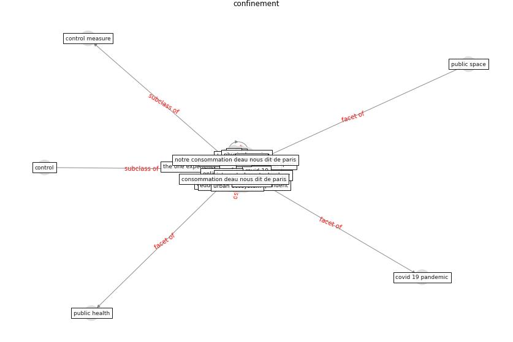

# Keyword: __confinement__
## Clusters

* Cluster 15: [green-urban](cluster_15)

## Concepts

 

## Top 10 articles for __confinement__
* Green in times of COVID-19: urban green space relevance
during the COVID-19 pandemic in Buenos Aires City ([marconi_green_2022](article_marconi_green_2022))
* A Mixed Approach on Resilience of Spanish
Dwellings and Households during COVID-19 Lockdown ([cuerdo-vilches_mixed_2020](article_cuerdo-vilches_mixed_2020))
* oecd_covid-19_2021 ([oecd_covid-19_2021](article_oecd_covid-19_2021))
* The Impact of COVID-19 on Public Space: A
Review of the Emerging Questions ([honey-roses_impact_2020](article_honey-roses_impact_2020))
* Psychological Effects of Home Confinement and
Social Distancing Derived from COVID-19 in the
General Population—A Systematic Review ([rodriguez-fernandez_psychological_2021](article_rodriguez-fernandez_psychological_2021))
* Exploring the Non-Medical impacts of Covid-19 using
Natural Language Processing ([agade_exploring_2020](article_agade_exploring_2020))
* What our response to the COVID-19 pandemic tells us of
our capacity to respond to climate change ([gemenne_what_2020](article_gemenne_what_2020))
* When the fourth water and digital revolution encountered
COVID-19 ([poch_when_2020](article_poch_when_2020))
* Association between indoor-outdoor green features and
psychological health during the COVID-19 lockdown in
Italy: A cross-sectional nationwide study ([spano_association_2021](article_spano_association_2021))
* COVID-19 and Green Housing: A Review of
Relevant Literature ([kaklauskas_covid-19_2021](article_kaklauskas_covid-19_2021))
