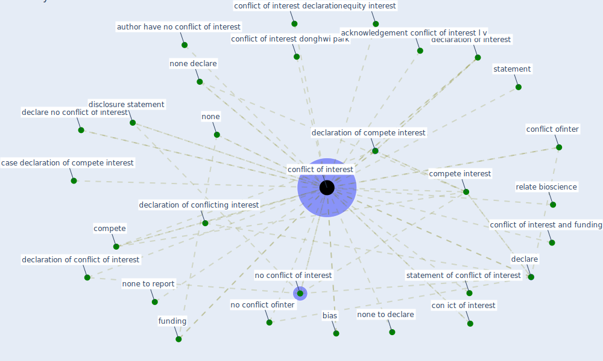

# Keyword: conflict of interest

## Keywords

 * acknowledgement conflict of interest, acknowledgement conflict of interest l v, author have no conflict of interest, bias, case declaration of compete interest, compete, compete interest, con ict of interest, [conflict of interest](keyword_conflict_of_interest), conflict of interest and funding, conflict of interest declaration, conflict of interest donghwi park, conflict of interest regard this article, conflict of interest statement, conflict of interests, conflict ofinter, conflicts of interest, conflicts of interests, declaration conflict of interest, declaration of compete interest, declaration of conflict of interest, declaration of conflicting interest, declaration of interest, declare, declare no, declare no conflict of interest, disclosure statement, equity interest, financialinterest, funding, interest, no conflict of interest, no conflict ofinter, none, none declare, none to declare, none to report, relate bioscience, statement, statement of conflict of interest

## Mapping

## Neighbours

### Closest articles

* How Can Blockchain Help People in the Event of Pandemics Such as the COVID-19? - [LINK](article_chang_how_2020)
* On the Coronavirus (COVID-19) Outbreak and the Smart City Network: Universal Data Sharing Standards Coupled with Artificial Intelligence (AI) to Benefit Urban Health Monitoring and Management - [LINK](article_allam_coronavirus_2020)
* Guidelines for resilience systems analysis - [LINK](article_oecd_guidelines_2014)
* Supporting Technologies for COVID-19 Prevention: Systemized Review - [LINK](article_zhao_supporting_2022)
* Making green infrastructure healthier infrastructure - [LINK](article_lohmus_making_2015)
* Construction of a Linked Data Set of COVID-19 Knowledge Graphs: Development and Applications - [LINK](article_wang_construction_2022)
* COVID-19 and its Modes of Transmission - [LINK](article_karia_covid-19_2020)
* Coronavirus disease 2019: The harms of exaggerated information and non‐evidence‐based measures - [LINK](article_ioannidis_coronavirus_2020)
* Antivirus-built environment: Lessons learned from Covid-19 pandemic - [LINK](article_megahed_antivirus-built_2020)
* Overcoming the Impact of COVID-19 Using Integrated Project Delivery Model - [LINK](article_g_overcoming_2020)

### Closest BPs

