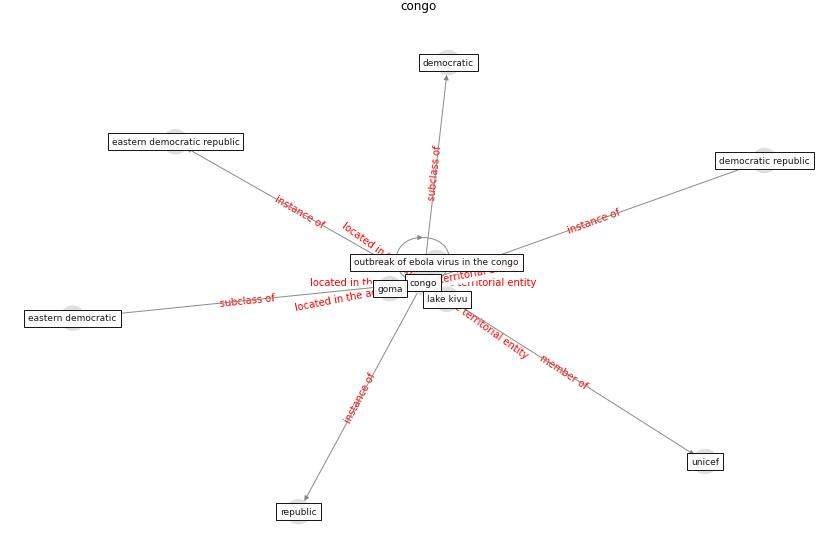

# Keyword: __congo__
## Clusters

* Cluster 14: [resilience-system](cluster_14)

## Concepts

 

## Top 10 articles for __congo__
* oecd_guidelines_2014 ([oecd_guidelines_2014](article_oecd_guidelines_2014))
* Exploring the Non-Medical impacts of Covid-19 using
Natural Language Processing ([agade_exploring_2020](article_agade_exploring_2020))
* world_bank_world_2022 ([world_bank_world_2022](article_world_bank_world_2022))
* Design COVID-19 Ontology: A Healthcare and
Safety Perspective ([aloulou_design_2022](article_aloulou_design_2022))
* How the 5G Enabled the COVID-19 Pandemic
Prevention and Control: Materiality, Affordance,
and (De-)Spatialization ([li_how_2022](article_li_how_2022))
