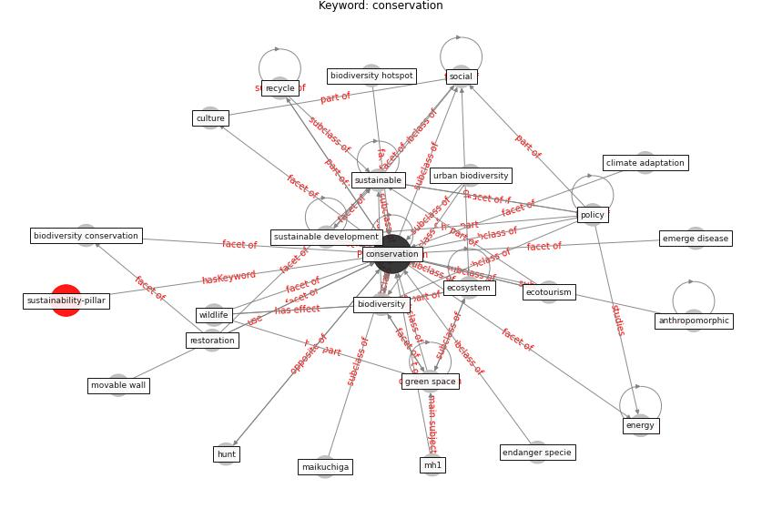

# Keyword: conservation

* [sustainability-pillar](cluster_Cluster_0)

## Keywords

 * Cluster_0, anthropomorphic, [biodiversity](keyword_biodiversity), biodiversity conservation, biodiversity hotspot, climate adaptation, [conservation](keyword_conservation), culture, [ecosystem](keyword_ecosystem), ecotourism, emerge disease, endanger specie, [energy](keyword_energy), [green space](keyword_green_space), hunt, maikuchiga, mh1, movable wall, [policy](keyword_policy), [recycle](keyword_recycle), restoration, [social](keyword_social), [sustainable](keyword_sustainable), [sustainable development](keyword_sustainable_development), urban biodiversity, wildlife

## Concepts

 

## Neighbours

### Closest articles

* How COVID-19 Could Accelerate the Adoption of New Retail Technologies and Enhance the (E-)Servicescape - [LINK](article_willems_how_2021)
* A critical analysis of the impacts of COVID-19 on the global economy and ecosystems and opportunities for circular economy strategies - [LINK](article_ibn-mohammed_critical_2021)
* Green infrastructure through the lens of “One Health”: A systematic review and integrative framework uncovering synergies and trade-offs between mental health and wildlife support in cities - [LINK](article_felappi_green_2020)
* Building sustainable finance for resilient protected and conserved areas: lessons from COVID-19 - [LINK](article_cumming_building_2021)
* Effects to Construction Project Management Impacted Circular Economic of Covid-19 Pandemic - [LINK](article_paikan_effects_2021)
* Building up an ecologically sustainable and socially desirable post-COVID-19 future - [LINK](article_duflot_building_2021)
* Urban planning after COVID-19 - [LINK](article_rtpi_urban_2021)
* Refleksioner fra en pandemi - [LINK](article_realdania_refleksioner_2022)
* Future (post-COVID) digital, smart and sustainable cities in the wake of 6G: Digital twins, immersive realities and new urban economies - [LINK](article_allam_future_2021)

### Closest BPs

