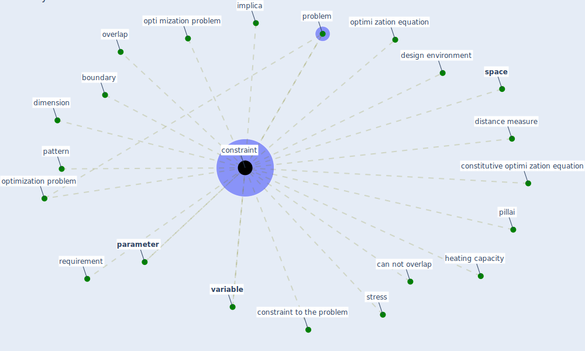

# Keyword: constraint

## Keywords

 * boundary, can not overlap, constitutive optimi zation equation, [constraint](keyword_constraint), constraint to the problem, constraints, design environment, dimension, distance measure, heating capacity, implica, opti mization problem, optimi zation equation, [optimization problem](keyword_optimization_problem), overlap, [parameter](keyword_parameter), pattern, pillai, problem, requirement, [space](keyword_space), [stress](keyword_stress), [variable](keyword_variable)

## Mapping

## Neighbours

### Closest articles

* Social distancing enhanced automated optimal design of physical spaces in the wake of the COVID-19 pandemic - [LINK](article_ugail_social_2021)
* The effect of occupant distribution on energy consumption and COVID-19 infection in buildings: A case study of university building - [LINK](article_mokhtari_effect_2021)
* COVID-19 Forced Hospitals to Build Negative Pressure Rooms Fast - [LINK](article_dyer_covid-19_2020)
* The ventilation of buildings and other mitigating measures for COVID-19: a focus on wintertime - [LINK](article_burridge_ventilation_2021)
* Treating two pandemics for the price of one: Chronic and infectious disease impacts of the built and natural environment - [LINK](article_frank_treating_2021)
* A comprehensive review on indoor air quality monitoring systems for enhanced public health - [LINK](article_saini_comprehensive_2020)

### Closest BPs

