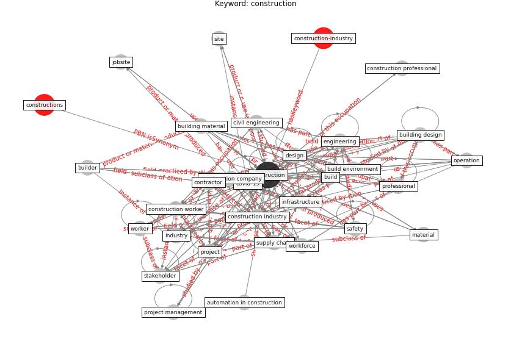

# Keyword: construction

* [construction-resilience](cluster_Cluster_5)

## Keywords

 * aec industry, [architect](keyword_architect), [architecture](keyword_architecture), automation, automation in construction, [bim](keyword_bim), [boston](keyword_boston), [build](keyword_build), build asset, [build environment](keyword_build_environment), build industry, build information modelling, builder, [building](keyword_building), building design, building material, building operation, building site, civil engineering, commission, [company](keyword_company), [construction](keyword_construction), [construction company](keyword_construction_company), construction engineer, [construction industry](keyword_construction_industry), construction management, construction manager, [construction professional](keyword_construction_professional), construction project, construction sector, construction site, construction stakeholder, [construction worker](keyword_construction_worker), consultant, [contractor](keyword_contractor), cost overrun, [covid-19](keyword_covid-19), decommissioning, demolition, [design](keyword_design), designer, [economy](keyword_economy), elevator, [employer](keyword_employer), engineer, [engineering](keyword_engineering), equipment, essential service, firm, fit out, good practice, [health and safety](keyword_health_and_safety), [hospital](keyword_hospital), [housing](keyword_housing), [industry](keyword_industry), [infrastructure](keyword_infrastructure), installation, insurance, jobsite, labor, life cycle, macroeconomy, [maintenance](keyword_maintenance), management, [manager](keyword_manager), material, mining, modular, modular construction, nonconstruction, north america, off site construction, [operation](keyword_operation), organization, [pandemic](keyword_pandemic), practitioner, prefabrication, [productivity](keyword_productivity), [professional](keyword_professional), [project](keyword_project), [project management](keyword_project_management), project manager, property, real estate, renovation, [resilience](keyword_resilience), [risk](keyword_risk), [safety](keyword_safety), [sector](keyword_sector), site, [stakeholder](keyword_stakeholder), subcontractor, [supply chain](keyword_supply_chain), sustainable construction, trade, [united kingdom](keyword_united_kingdom), [value engineering](keyword_value_engineering), [worker](keyword_worker), workforce, [workplace](keyword_workplace)

## Concepts

 

## Neighbours

### Closest articles

* Guidelines for Responding to COVID-19 Pandemic: Best Practices, Impacts, and Future Research Directions - [LINK](article_assaad_guidelines_2021)
* Influence between COVID-19 Impacts and Project Stakeholders in Chilean Construction Projects - [LINK](article_araya_influence_2021)
* Propositions for a Resilient, Post-COVID-19 Future for the AEC Industry - [LINK](article_nassereddine_propositions_2021)
* Analysis of COVID-19 Concerns Raised by the Construction Workforce and Development of Mitigation Practices - [LINK](article_bou_hatoum_analysis_2021)
* COVID-19 pandemic: the effects and prospects in the construction industry. - [LINK](article_ogunnusi_covid-19_2020)
* Strategies to Mitigate COVID-19 Pandemic Impacts on Health and Safety of Workers in Construction Projects - [LINK](article_kaushal_strategies_2021)
* Perception of COVID-19 impacts on the construction industry over time - [LINK](article_rokooei_perception_2022)
* Revisiting the built environment: 10 potential development changes and paradigm shifts due to COVID-19 - [LINK](article_cheshmehzangi_revisiting_2021)
* A Global Survey of Infection Control and Mitigation Measures for Combating the Transmission of COVID-19 Pandemic in Buildings Under Facilities Management Services - [LINK](article_sarvari_global_2022)
* Impacts of COVID-19 on Health and Safety of Workforce in Construction Industry - [LINK](article_pamidimukkala_impacts_2021)

### Closest BPs

