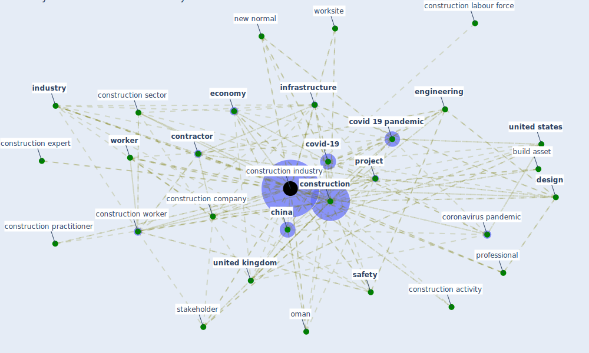

# Keyword: construction industry

## Keywords

 * [area](keyword_area), automation, [build](keyword_build), build asset, build information modeling, [china](keyword_china), [construction](keyword_construction), construction activity, construction business, construction company, construction engineering, construction expert, construction firm, [construction industry](keyword_construction_industry), construction industry sector, construction labour force, construction practitioner, construction project, construction sector, construction stakeholder, [construction worker](keyword_construction_worker), [contractor](keyword_contractor), coronavirus pandemic, cost overrun, cost overrun factor, [covid 19 pandemic](keyword_covid_19_pandemic), [covid-19](keyword_covid-19), [crisis](keyword_crisis), delay, [design](keyword_design), developer, [economy](keyword_economy), [employee](keyword_employee), [engineering](keyword_engineering), facility management operation, field, fourth huge crisis, general, ghana, globally, good practice, [government](keyword_government), green building certification and rating system, [health and safety](keyword_health_and_safety), health and safety rule, health and safety rule signage, [human](keyword_human), [impact](keyword_impact), [industry](keyword_industry), information base construction management, [infrastructure](keyword_infrastructure), insurance, [kuwait](keyword_kuwait), labor intensive, likert scale, [malaysia](keyword_malaysia), modular infrastructure, new normal, [nigeria](keyword_nigeria), oman, on site construction, operationally, overall economy, [pandemic](keyword_pandemic), pro and con, production strategy, [professional](keyword_professional), [project](keyword_project), project base industry, [risk](keyword_risk), risk management, risk taker, [safety](keyword_safety), safety and health compliance, [sector](keyword_sector), [stakeholder](keyword_stakeholder), stakeholder category, statistic, sub saharan africa, subcontractor, subsidy and waiver, suffolk construction, [supply chain](keyword_supply_chain), survival, [sustainability](keyword_sustainability), [sustainable development](keyword_sustainable_development), sustainable green building, the fallout of the economy, the law, the pandemic, transportation development, u s, uae, uk construction, [united kingdom](keyword_united_kingdom), [united states](keyword_united_states), [worker](keyword_worker), [workforce](keyword_workforce), [workplace](keyword_workplace), worksite

## Mapping

## Neighbours

### Closest articles

* Guidelines for Responding to COVID-19 Pandemic: Best Practices, Impacts, and Future Research Directions - [LINK](article_assaad_guidelines_2021)
* Mechanisms for addressing the impact of COVID-19 on infrastructure projects - [LINK](article_king_mechanisms_2021)
* The Impact of Pandemic Crisis on the Survival of Construction Industry: A Case of COVID-19 - [LINK](article_gamil_impact_2020)
* Influence between COVID-19 Impacts and Project Stakeholders in Chilean Construction Projects - [LINK](article_araya_influence_2021)
* Perception of COVID-19 impacts on the construction industry over time - [LINK](article_rokooei_perception_2022)
* COVID-19 pandemic: the effects and prospects in the construction industry. - [LINK](article_ogunnusi_covid-19_2020)
* Analysis of COVID-19 Concerns Raised by the Construction Workforce and Development of Mitigation Practices - [LINK](article_bou_hatoum_analysis_2021)
* The Effects of Pandemic on Construction Industry in the UK - [LINK](article_shibani_effects_2020)
* Propositions for a Resilient, Post-COVID-19 Future for the AEC Industry - [LINK](article_nassereddine_propositions_2021)
* Covid-19 Associated Risks and Mitigation Strategies relevant for the UK Construction Industry - [LINK](article_dan-jumbo_covid-19_2021)

### Closest BPs

