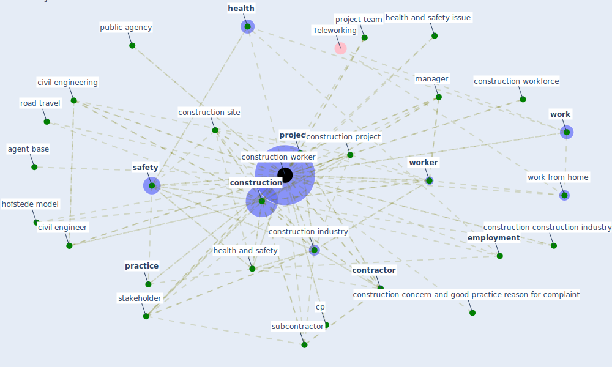

# Keyword: construction worker

## Keywords

 * agent base, civil engineer, civil engineering, [construction](keyword_construction), construction concern, construction concern and good practice reason for complaint, construction construction industry, [construction industry](keyword_construction_industry), construction project, construction safety, construction sector, construction site, [construction worker](keyword_construction_worker), construction workforce, [contractor](keyword_contractor), correspondence plot, cp, descriptive datum, [employment](keyword_employment), [health](keyword_health), [health and safety](keyword_health_and_safety), health and safety issue, hofstede model, [industry](keyword_industry), industry job, infrastructural, [infrastructure](keyword_infrastructure), labor shortage, [manager](keyword_manager), onsite condition, [practice](keyword_practice), [project](keyword_project), project team, public agency, road travel, [safety](keyword_safety), safety awareness, [stakeholder](keyword_stakeholder), subcontractor, [work](keyword_work), work from home, [worker](keyword_worker), [workplace](keyword_workplace)

## Mapping

## Neighbours

### Closest articles

* Influence between COVID-19 Impacts and Project Stakeholders in Chilean Construction Projects - [LINK](article_araya_influence_2021)
* Strategies to Mitigate COVID-19 Pandemic Impacts on Health and Safety of Workers in Construction Projects - [LINK](article_kaushal_strategies_2021)
* Analysis of COVID-19 Concerns Raised by the Construction Workforce and Development of Mitigation Practices - [LINK](article_bou_hatoum_analysis_2021)
* Impacts of COVID-19 on Health and Safety of Workforce in Construction Industry - [LINK](article_pamidimukkala_impacts_2021)
* Guidelines for Responding to COVID-19 Pandemic: Best Practices, Impacts, and Future Research Directions - [LINK](article_assaad_guidelines_2021)
* Propositions for a Resilient, Post-COVID-19 Future for the AEC Industry - [LINK](article_nassereddine_propositions_2021)
* Effects to Construction Project Management Impacted Circular Economic of Covid-19 Pandemic - [LINK](article_paikan_effects_2021)
* Seeing the invisible hand: Underlying effects of COVID-19 on tourists’ behavioral patterns - [LINK](article_li_seeing_2020)
* Perception of COVID-19 impacts on the construction industry over time - [LINK](article_rokooei_perception_2022)

### Closest BPs

