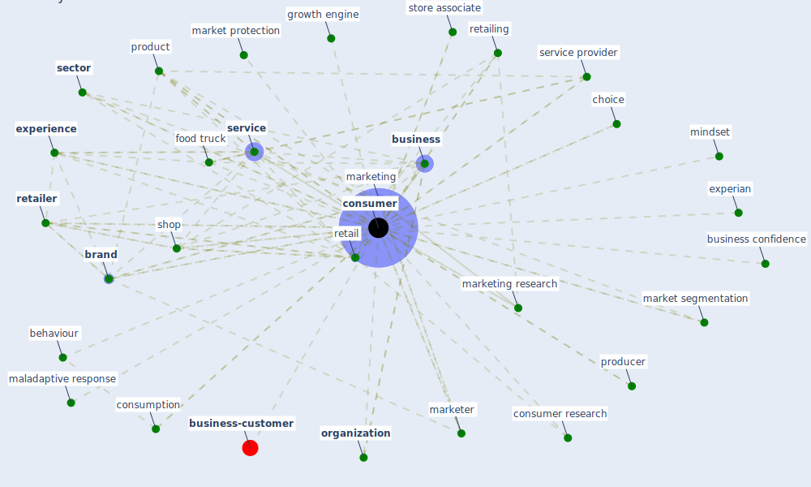

# Keyword: consumer

* [business-customer](cluster_11)

## Keywords

 * Cluster_11, advertising, [attitude](keyword_attitude), bankruptcy law, behavior, behaviour, [brand](keyword_brand), brand equity, [business](keyword_business), business confidence, buyer s remorse, cashless, choice, choose the brand, confusion, [consumer](keyword_consumer), consumer behaviour, consumer hoarding, consumer psychology, consumer research, consumer segment, consumerist, consumers, consumption, consumption experience, consumption habit, corporation, [customer](keyword_customer), [customer journey](keyword_customer_journey), [datum](keyword_datum), e commerce, ecoconscious, economic transaction, ethical, experian, [experience](keyword_experience), financial, food, food industry, food truck, good, [government](keyword_government), government guideline, green brand, growth engine, hand sanitizer, health and wellbeing, [healthcare](keyword_healthcare), maladaptive response, [market](keyword_market), market protection, market segmentation, marketer, [marketing](keyword_marketing), marketing research, memory, millennial, mindset, moreover, new brand, online shopping, online tourism, operate hour, [organization](keyword_organization), panic buying, [perspective](keyword_perspective), plan behavior, [policy](keyword_policy), price sensitivity, producer, product, product or service, pyramidsdx com, rejectionist, retail, [retailer](keyword_retailer), retailing, salesperson, [sector](keyword_sector), segment, seller, [service](keyword_service), service provider, [shop](keyword_shop), shop online, shopping basket, shopping habit, [smartphone](keyword_smartphone), store associate, [strategy](keyword_strategy), tourist, trust, [united states](keyword_united_states), utility, value, word ofmouth

## Mapping

## Neighbours

### Closest articles

* How COVID-19 Could Accelerate the Adoption of New Retail Technologies and Enhance the (E-)Servicescape - [LINK](article_willems_how_2021)
* World Bank Development Report - [LINK](article_world_bank_world_2022)
* Urban planning after COVID-19 - [LINK](article_rtpi_urban_2021)
* Proximity and post-COVID-19 urban development: Reflections from Milan, Italy - [LINK](article_tricarico_proximity_2021)
* Retail Signage During the COVID-19 Pandemic - [LINK](article_mcneish_retail_2020)
* Should I Stay or Should I Go? Tourists’ COVID-19 Risk Perception and Vacation Behavior Shift - [LINK](article_bratic_should_2021)
* Mapping research in logistics and supply chain management during COVID-19 pandemic - [LINK](article_montoya-torres_mapping_2021)
* A critical analysis of the impacts of COVID-19 on the global economy and ecosystems and opportunities for circular economy strategies - [LINK](article_ibn-mohammed_critical_2021)
* How COVID-19 Redefines the Concept of Sustainability - [LINK](article_hakovirta_how_2020)
* Seeing the invisible hand: Underlying effects of COVID-19 on tourists’ behavioral patterns - [LINK](article_li_seeing_2020)

### Closest BPs

