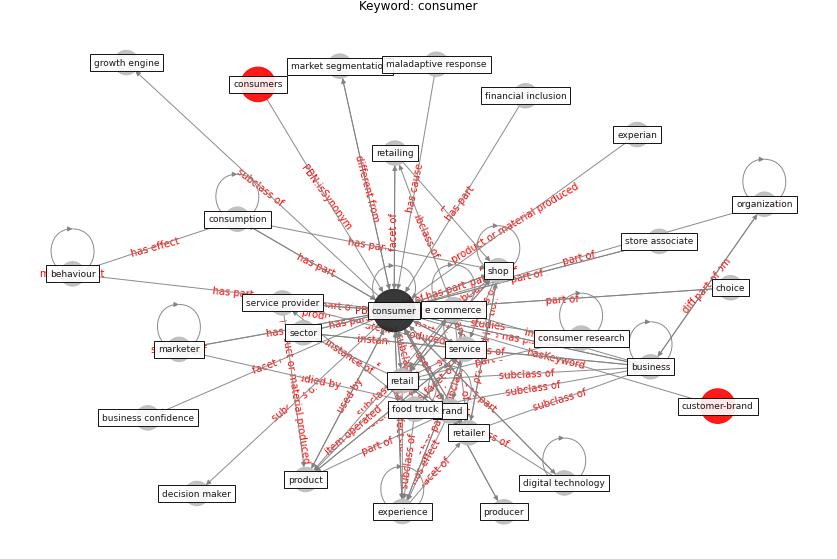

# Keyword: consumer

* [customer-brand](cluster_Cluster_8)

## Keywords

 * Cluster_8, advertising, attitude, bankruptcy law, behavior, behaviour, [brand](keyword_brand), brand equity, [business](keyword_business), business confidence, buyer s remorse, cashless, choice, choose the brand, citizen, confusion, [consumer](keyword_consumer), consumer behaviour, consumer hoarding, consumer psychology, consumer research, consumer segment, consumerist, consumers, consumption, consumption experience, consumption habit, corporation, [customer](keyword_customer), [customer journey](keyword_customer_journey), [datum](keyword_datum), decision maker, [digital technology](keyword_digital_technology), e commerce, ecoconscious, [economic](keyword_economic), ethical, experian, experience, financial, financial inclusion, financial service, [food](keyword_food), food industry, food truck, good, [government](keyword_government), government guideline, green brand, growth engine, hand sanitizer, health and wellbeing, [healthcare](keyword_healthcare), maladaptive response, market, market protection, market segmentation, marketer, [marketing](keyword_marketing), marketing research, memory, millennial, mindset, [online shopping](keyword_online_shopping), operate hour, [organization](keyword_organization), [perspective](keyword_perspective), plan behavior, [policy](keyword_policy), price sensitivity, producer, product, product or service, pyramidsdx com, rejectionist, [retail](keyword_retail), [retailer](keyword_retailer), [retailing](keyword_retailing), salesperson, sector, segment, [service](keyword_service), service provider, shop, shop online, shopping basket, shopping habit, smartphone, social dining, [social interaction](keyword_social_interaction), [social medium](keyword_social_medium), store associate, strategy, tourist, [travel](keyword_travel), trust, [united states](keyword_united_states), utility, value, virtual world

## Concepts

 

## Neighbours

### Closest articles

* How COVID-19 Could Accelerate the Adoption of New Retail Technologies and Enhance the (E-)Servicescape - [LINK](article_willems_how_2021)
* World Bank Development Report - [LINK](article_world_bank_world_2022)
* Urban planning after COVID-19 - [LINK](article_rtpi_urban_2021)
* Organizations’ Management of the COVID-19 Pandemic: A Scoping Review of Business Articles - [LINK](article_boiral_organizations_2021)
* Touchless Retail: What the Rest of the World could learn from China’s new ways to shop - [LINK](article_capgemini_touchless_2020)
* Retail Signage During the COVID-19 Pandemic - [LINK](article_mcneish_retail_2020)
* Mapping research in logistics and supply chain management during COVID-19 pandemic - [LINK](article_montoya-torres_mapping_2021)
* A critical analysis of the impacts of COVID-19 on the global economy and ecosystems and opportunities for circular economy strategies - [LINK](article_ibn-mohammed_critical_2021)
* Should I Stay or Should I Go? Tourists’ COVID-19 Risk Perception and Vacation Behavior Shift - [LINK](article_bratic_should_2021)

### Closest BPs

