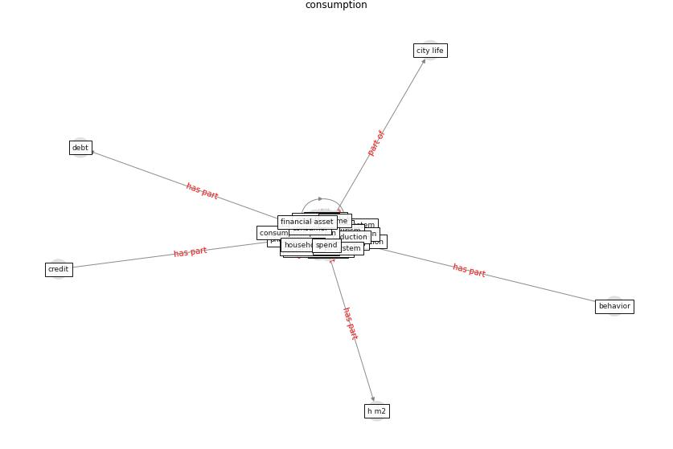

# Keyword: __consumption__
## Clusters

* Cluster 0: [energy-building](cluster_0)

## Concepts

 

## Top 10 articles for __consumption__
* rtpi_urban_2021 ([rtpi_urban_2021](article_rtpi_urban_2021))
* realdania_refleksioner_2022_EN ([realdania_refleksioner_2022_EN](article_realdania_refleksioner_2022_EN))
* A Mixed Approach on Resilience of Spanish
Dwellings and Households during COVID-19 Lockdown ([cuerdo-vilches_mixed_2020](article_cuerdo-vilches_mixed_2020))
* Global value chains: Efficiency and risks in the context
of COVID-19 ([oecd_global_2021](article_oecd_global_2021))
* A critical analysis of the impacts of COVID-19 on the
global economy and ecosystems and opportunities for
circular economy strategies ([ibn-mohammed_critical_2021](article_ibn-mohammed_critical_2021))
* COVID-19 and Green Housing: A Review of
Relevant Literature ([kaklauskas_covid-19_2021](article_kaklauskas_covid-19_2021))
* COVID-19 and Living space challenge. Well-being and
Public Health recommendations for a healthy, safe, and
sustainable housing. ([dalessandro_covid-19_2020](article_dalessandro_covid-19_2020))
* Computational analysis of SARS-CoV-2/COVID-19
surveillance by wastewater-based epidemiology locally and
globally: Feasibility, economy, opportunities and
challenges ([hart_computational_2020](article_hart_computational_2020))
* The effect of occupant distribution on energy consumption
and COVID-19 infection in buildings: A case study of
university building ([mokhtari_effect_2021](article_mokhtari_effect_2021))
* The socio-economic implications of the coronavirus
pandemic (COVID-19): A review ([nicola_socio-economic_2020](article_nicola_socio-economic_2020))
