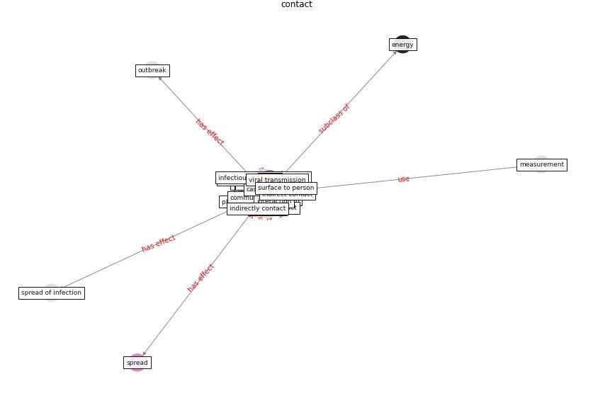

# Keyword: __contact__
## Clusters

* Cluster 13: [blockchain-technology](cluster_13)

## Concepts

 

## Articles
* Green Buildings: A Post COVID-19 Analysis of
Preventive Measures of Spreading the Virus ([yakubu_aminu_dodo_green_2020](article_yakubu_aminu_dodo_green_2020))
* The ventilation of buildings and other mitigating measures
for COVID-19: a focus on wintertime ([burridge_ventilation_2021](article_burridge_ventilation_2021))
* COVID-ABS: An agent-based model of COVID-19
epidemic to simulate health and economic effects of social
distancing interventions ([silva_covid-abs_2020](article_silva_covid-abs_2020))
* Persistence of coronaviruses on inanimate surfaces and
their inactivation with biocidal agents ([kampf_persistence_2020](article_kampf_persistence_2020))
* COVID-ABS: An agent-based model of COVID-19
epidemic to simulate health and economic effects of social
distancing interventions ([silva_covid-abs_2020](article_silva_covid-abs_2020))
* Guidelines for Responding to COVID-19 Pandemic:
Best Practices, Impacts, and Future Research
Directions ([assaad_guidelines_2021](article_assaad_guidelines_2021))
* Mobile Technology Solution for COVID-19:
Surveillance and Prevention ([raza_mobile_2021](article_raza_mobile_2021))
* COVID-19 Could Leverage a Sustainable Built
Environment ([pinheiro_covid-19_2020](article_pinheiro_covid-19_2020))
* harvard_chan_community_coronavirus_2020 ([harvard_chan_community_coronavirus_2020](article_harvard_chan_community_coronavirus_2020))
* Ventilation use in nonmedical settings during COVID-19:
Cleaning protocol, maintenance, and recommendations ([nembhard_ventilation_2020](article_nembhard_ventilation_2020))
