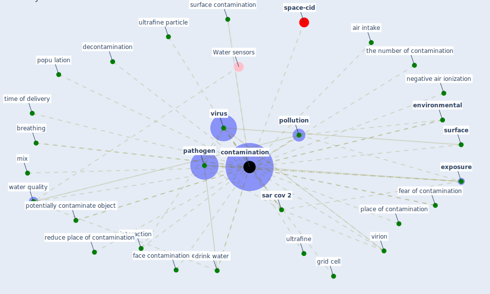

# Keyword: contamination

* [space-cid](cluster_2)

## Keywords

 * Cluster_2, air intake, blank sample, body fluid, breathing, [contamination](keyword_contamination), contamination by those come from abroad, contaminations, [coronavirus](keyword_coronavirus), [decontamination](keyword_decontamination), drink water, [environmental](keyword_environmental), [exposure](keyword_exposure), face contamination event, fear of contamination, grid cell, [interaction](keyword_interaction), mix, negative air ionization, [pathogen](keyword_pathogen), place of contamination, [pollution](keyword_pollution), popu lation, potentially contaminate object, reduce place of contamination, [sar cov 2](keyword_sar_cov_2), [surface](keyword_surface), surface contamination, the number of contamination, time of delivery, ultrafine, ultrafine particle, virion, [virus](keyword_virus), water quality, weight

## Mapping

## Neighbours

### Closest articles

* COVID-19 Could Leverage a Sustainable Built Environment - [LINK](article_pinheiro_covid-19_2020)
* Designing a Multi-Agent Occupant Simulation System to Support Facility Planning and Analysis for COVID-19 - [LINK](article_lee_designing_2021)
* Readiness Assessment of Green Building Certification Systems for Residential Buildings during Pandemics - [LINK](article_tleuken_readiness_2021)
* Indoor Air Quality: Rethinking rules of building design strategies in post-pandemic architecture - [LINK](article_megahed_indoor_2021)
* DeepSOCIAL: Social Distancing Monitoring and Infection Risk Assessment in COVID-19 Pandemic - [LINK](article_rezaei_deepsocial_2020)
* How COVID-19 Could Accelerate the Adoption of New Retail Technologies and Enhance the (E-)Servicescape - [LINK](article_willems_how_2021)
* COVID-19 Pandemic: Prevention and Protection Measures to Be Adopted at the Workplace - [LINK](article_cirrincione_covid-19_2020)
* Questioning the use of the balcony in apartments during the COVID-19 pandemic process - [LINK](article_aydin_questioning_2020)
* COVID-19 risks and systemic gaps in Nigeria: resilience building lessons for pandemic and climate change management - [LINK](article_lawal_covid-19_2022)
* 2019 Novel Coronavirus (COVID-19) Pandemic: Built Environment Considerations To Reduce Transmission - [LINK](article_dietz_2019_2020)

### Closest BPs

