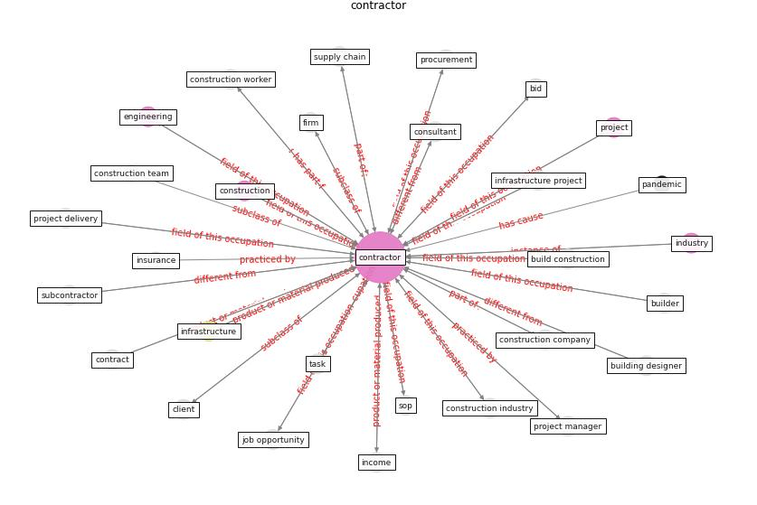

# Keyword: __contractor__
## Clusters

* Cluster 3: [construction-project](cluster_3.md)

## Concepts

 

## Articles
* Mechanisms for addressing the impact of COVID-19 on
infrastructure projects ([king_mechanisms_2021](article_king_mechanisms_2021.md))
* Overcoming the Impact of COVID-19 Using Integrated
Project Delivery Model ([g_overcoming_2020](article_g_overcoming_2020.md))
* The Effects of Pandemic on Construction Industry
in the UK ([shibani_effects_2020](article_shibani_effects_2020.md))
* nassereddine_propositions_2021 ([nassereddine_propositions_2021](article_nassereddine_propositions_2021.md))
* realdania_refleksioner_2022_EN ([realdania_refleksioner_2022_EN](article_realdania_refleksioner_2022_EN.md))
* Guidelines for Responding to COVID-19 Pandemic:
Best Practices, Impacts, and Future Research
Directions ([assaad_guidelines_2021](article_assaad_guidelines_2021.md))
* Guidelines for Responding to COVID-19 Pandemic:
Best Practices, Impacts, and Future Research
Directions ([assaad_guidelines_2021](article_assaad_guidelines_2021.md))
* Guidelines for Responding to COVID-19 Pandemic:
Best Practices, Impacts, and Future Research
Directions ([assaad_guidelines_2021](article_assaad_guidelines_2021.md))
* Analysis of COVID-19 Concerns Raised by the
Construction Workforce and Development of
Mitigation Practices ([bou_hatoum_analysis_2021](article_bou_hatoum_analysis_2021.md))
* A Global Survey of Infection Control and
Mitigation Measures for Combating the Transmission
of COVID-19 Pandemic in Buildings Under
Facilities Management Services ([sarvari_global_2022](article_sarvari_global_2022.md))
