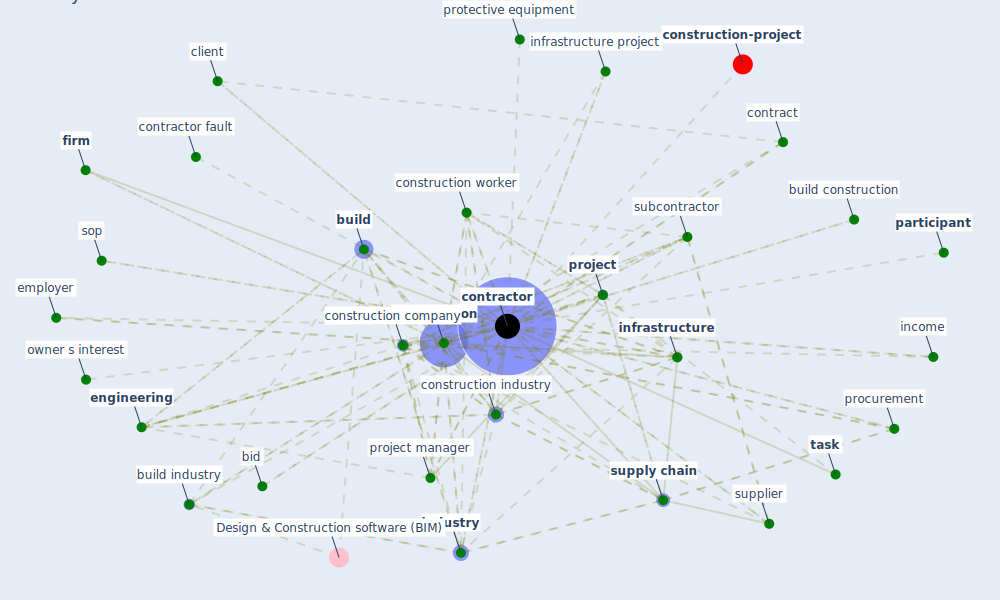

# Keyword: contractor

* [construction-project](cluster_8)

## Keywords

 * Cluster_8, asset manager, bid, bidding process, [build](keyword_build), build construction, build expert, build industry, building design, building designer, [clean](keyword_clean), client, [construction](keyword_construction), construction company, construction firm, [construction industry](keyword_construction_industry), construction methodology, construction safety, construction team, [construction worker](keyword_construction_worker), [contract](keyword_contract), contract term, [contractor](keyword_contractor), contractor fault, contractor problem, contractors, deloitte, diversification, [employer](keyword_employer), [engineering](keyword_engineering), [firm](keyword_firm), [government](keyword_government), [health and safety](keyword_health_and_safety), income, [industry](keyword_industry), [infrastructure](keyword_infrastructure), infrastructure project, insurance, insurance policy, job opportunity, modularization, owner s interest, [pandemic](keyword_pandemic), [participant](keyword_participant), performance, procurement, [project](keyword_project), project delivery, project manager, protective equipment, respond plan, salary, sop, subcontractor, supplier, [supply chain](keyword_supply_chain), [task](keyword_task), tender

## Mapping

## Neighbours

### Closest articles

* Mechanisms for addressing the impact of COVID-19 on infrastructure projects - [LINK](article_king_mechanisms_2021)
* Guidelines for Responding to COVID-19 Pandemic: Best Practices, Impacts, and Future Research Directions - [LINK](article_assaad_guidelines_2021)
* Overcoming the Impact of COVID-19 Using Integrated Project Delivery Model - [LINK](article_g_overcoming_2020)
* The Effects of Pandemic on Construction Industry in the UK - [LINK](article_shibani_effects_2020)
* Propositions for a Resilient, Post-COVID-19 Future for the AEC Industry - [LINK](article_nassereddine_propositions_2021)
* Analysis of COVID-19 Concerns Raised by the Construction Workforce and Development of Mitigation Practices - [LINK](article_bou_hatoum_analysis_2021)
* A Global Survey of Infection Control and Mitigation Measures for Combating the Transmission of COVID-19 Pandemic in Buildings Under Facilities Management Services - [LINK](article_sarvari_global_2022)
* Influence between COVID-19 Impacts and Project Stakeholders in Chilean Construction Projects - [LINK](article_araya_influence_2021)
* Covid-19 Associated Risks and Mitigation Strategies relevant for the UK Construction Industry - [LINK](article_dan-jumbo_covid-19_2021)
* Effects to Construction Project Management Impacted Circular Economic of Covid-19 Pandemic - [LINK](article_paikan_effects_2021)

### Closest BPs

