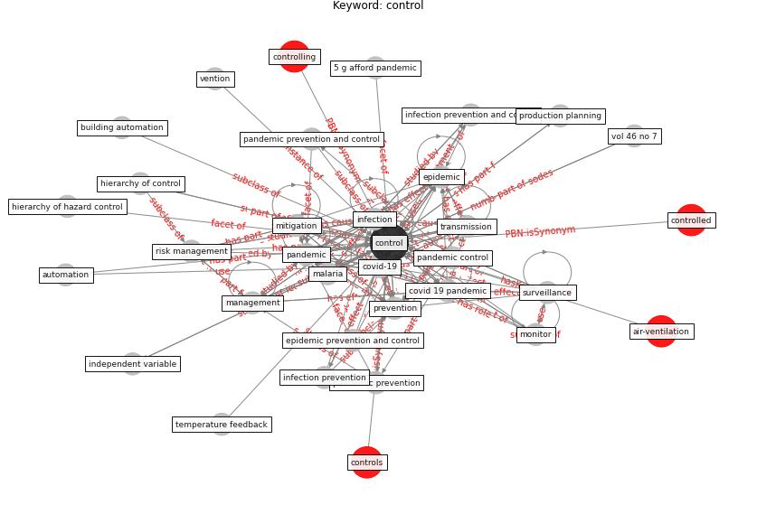

# Keyword: __control__
## Clusters

* Cluster 2: [air-sars](cluster_2)
* Cluster 6: [smart-iot](cluster_6)
* Cluster 11: [uvgi-uv](cluster_11)

## Concepts

 

## Articles
* How the 5G Enabled the COVID-19 Pandemic
Prevention and Control: Materiality, Affordance,
and (De-)Spatialization ([li_how_2022](article_li_how_2022))
* Design COVID-19 Ontology: A Healthcare and
Safety Perspective ([aloulou_design_2022](article_aloulou_design_2022))
* Assessment of Building Automation and Control
Systems in Danish Healthcare Facilities in the
COVID-19 Era ([pedersen_assessment_2022](article_pedersen_assessment_2022))
* A Global Survey of Infection Control and
Mitigation Measures for Combating the Transmission
of COVID-19 Pandemic in Buildings Under
Facilities Management Services ([sarvari_global_2022](article_sarvari_global_2022))
* Indoor Air Quality: Rethinking rules of building
design strategies in post-pandemic architecture ([megahed_indoor_2021](article_megahed_indoor_2021))
* COVID-19 Experience Transforming the Protective
Environment of Office Buildings and Spaces ([phapant_covid-19_2021](article_phapant_covid-19_2021))
* A Review on Building Design as a Biomedical
System for Preventing COVID-19 Pandemic ([amran_review_2022](article_amran_review_2022))
* A Global Survey of Infection Control and
Mitigation Measures for Combating the Transmission
of COVID-19 Pandemic in Buildings Under
Facilities Management Services ([sarvari_global_2022](article_sarvari_global_2022))
* Green Buildings: A Post COVID-19 Analysis of
Preventive Measures of Spreading the Virus ([yakubu_aminu_dodo_green_2020](article_yakubu_aminu_dodo_green_2020))
* realdania_refleksioner_2022_EN ([realdania_refleksioner_2022_EN](article_realdania_refleksioner_2022_EN))
