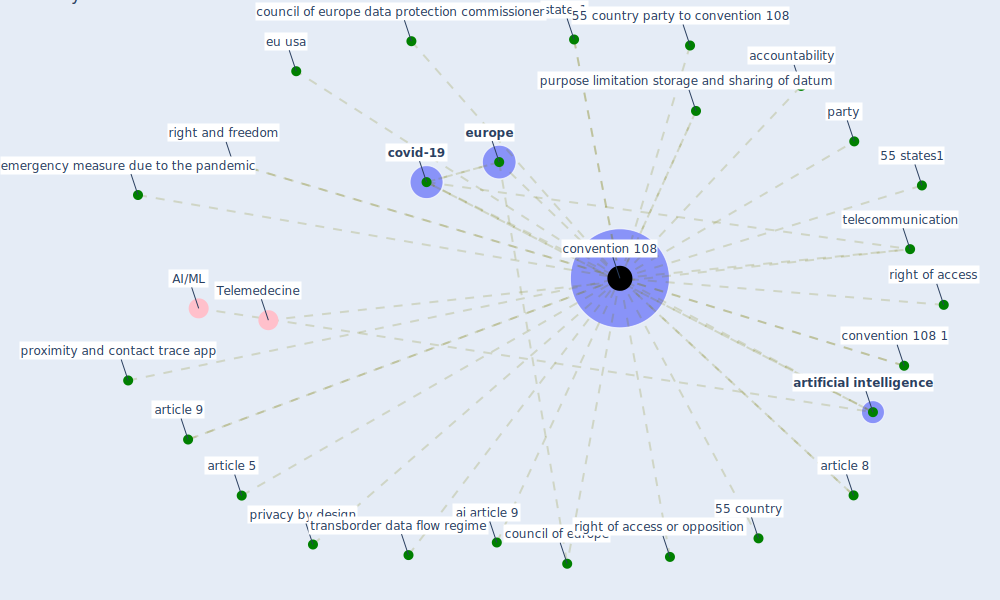

# Keyword: convention 108

## Keywords

 * 55 country, 55 country party to convention 108, 55 states1, accountability, ai article 9, article 5, article 8, article 9, [artificial intelligence](keyword_artificial_intelligence), [convention 108](keyword_convention_108), convention 108 1, council of europe, council of europe data protection commissioner, [covid-19](keyword_covid-19), emergency measure due to the pandemic, eu usa, [europe](keyword_europe), party, privacy by design, proximity and contact trace app, purpose limitation storage and sharing of datum, right and freedom, right of access, right of access or opposition, states1, telecommunication, transborder data flow regime

## Mapping

## Neighbours

### Closest articles

* 2020 Data Protection Report - [LINK](article_council_of_europe_2020_2020)

### Closest BPs

