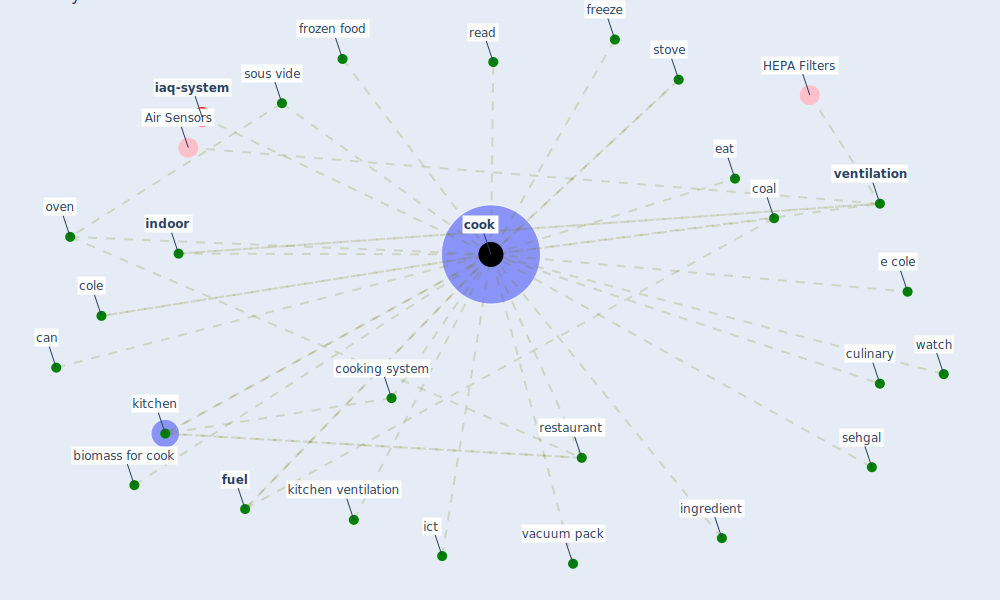

# Keyword: cook

* [iaq-system](cluster_3)

## Keywords

 * Cluster_3, biomass for cook, can, coal, cole, [cook](keyword_cook), cooked, cooking, cooking system, culinary, e cole, eat, freeze, frozen food, [fuel](keyword_fuel), ict, [indoor](keyword_indoor), ingredient, kitchen, kitchen ventilation, oven, read, restaurant, sehgal, sous vide, stove, vacuum pack, [ventilation](keyword_ventilation), watch

## Mapping

## Neighbours

### Closest articles

* How COVID-19 Could Accelerate the Adoption of New Retail Technologies and Enhance the (E-)Servicescape - [LINK](article_willems_how_2021)
* A comprehensive review on indoor air quality monitoring systems for enhanced public health - [LINK](article_saini_comprehensive_2020)
* The Effect of Opening Windows on Air Change Rates in Two Homes - [LINK](article_howard-reed_effect_2002)
* ASHRAE Position Document on Infectious Aerosols - [LINK](article_ashrae_ashrae_2022)
* Occupant health in buildings: Impact of the COVID-19 pandemic on the opinions of building professionals and implications on research - [LINK](article_awada_occupant_2022)
* Environmental factors involved in SARS-CoV-2 transmission: effect and role of indoor environmental quality in the strategy for COVID-19 infection control - [LINK](article_azuma_environmental_2020)
* How the Coronavirus Will Reshape Architecture - [LINK](article_chayka_how_2020)
* COVID-19 media fatigue: predictors of decreasing interest and avoidance of COVID-19–related news - [LINK](article_buneviciene_covid-19_2021)
* A critical review of heating, ventilation, and air conditioning (HVAC) systems within the context of a global SARS-CoV-2 epidemic - [LINK](article_elsaid_critical_2021)

### Closest BPs

