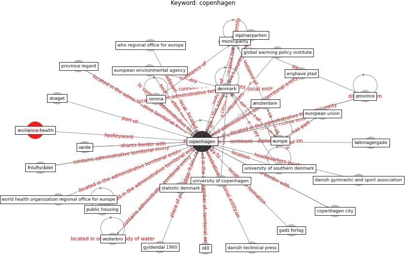

# Keyword: copenhagen

* [resilience-health](cluster_Cluster_13)

## Keywords

 * 5 000 copenhagener, Cluster_13, aalborg university, aarhus, amsterdam, beeley, big city, big city generally have the most congestion, borgen, bridge quarter, c40, [city](keyword_city), city museum, [copenhagen](keyword_copenhagen), copenhagen city, [corona](keyword_corona), corona pandemic, danish, danish gymnastic and sport association, danish technical press, danske klassikere, [denmark](keyword_denmark), enghave plad, [europe](keyword_europe), european environmental agency, [european union](keyword_european_union), friluftsrådet, gads forlag, gads forlag copenhagen, global warming policy institute, great, gyldendal 1960, hip bridge quarter, jutland, kristensen, købmagergade, landsdel copenhagen, mjølnerparken, municipality, municipality that have the high absolute number of net migrant, national centre for social research, norway, [pandemic](keyword_pandemic), police, [province](keyword_province), province regard, [public housing](keyword_public_housing), recovery during the pandemic, statens serum institute, statistic denmark, strøget, [sustainable development goal](keyword_sustainable_development_goal), university of copenhagen, university of southern denmark, varde, vesterbro, who, who regional office for europe, who regional office foreurope, world health organization, world health organization regional office for europe

## Concepts

 

## Neighbours

### Closest articles

* Strengthening resilience: a priority shared by Health 2020 and - [LINK](article_who_strengthening_2017)
* Continuous IEQ monitoring system: Context and development - [LINK](article_parkinson_continuous_2019)
* The role of green roofs in post COVID-19 confinement: An analysis of willingness to pay - [LINK](article_manso_role_2021)
* Refleksioner fra en pandemi - [LINK](article_realdania_refleksioner_2022)
* A Review on Building Design as a Biomedical System for Preventing COVID-19 Pandemic - [LINK](article_amran_review_2022)
* Sustainable work throughout the life course: National policies and strategies, Publications Office of the European Union - [LINK](article_eurofund_sustainable_2016)
* The impact of the COVID-19 pandemic on the importance of urban green spaces to the public - [LINK](article_noszczyk_impact_2022)
* COVID-19 Could Leverage a Sustainable Built Environment - [LINK](article_pinheiro_covid-19_2020)
* Navigating Climate Change: Rethinking the Role of Buildings - [LINK](article_cole_navigating_2020)

### Closest BPs

