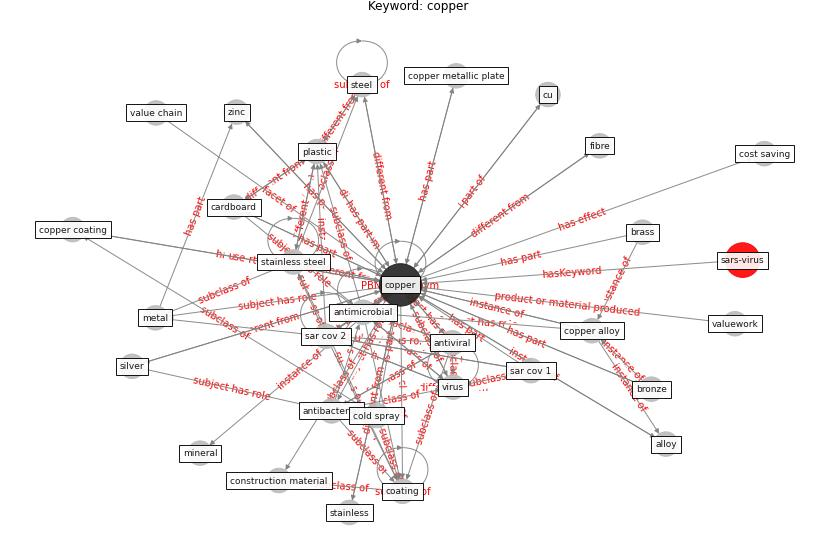

# Keyword: __copper__

## Concepts

 

## Top articles for __copper__
* Sars-CoV-2 (COVID-19) inactivation capability of
copper-coated touch surface fabricated by cold-spray
technology ([hutasoit_sars-cov-2_2020](article_hutasoit_sars-cov-2_2020))
* Designing Post COVID-19 Buildings: Approaches for
Achieving Healthy Buildings ([navaratnam_designing_2022](article_navaratnam_designing_2022))
* Aerosol and Surface Stability of SARS-CoV-2 as
Compared with SARS-CoV-1 ([van_doremalen_aerosol_2020](article_van_doremalen_aerosol_2020))
