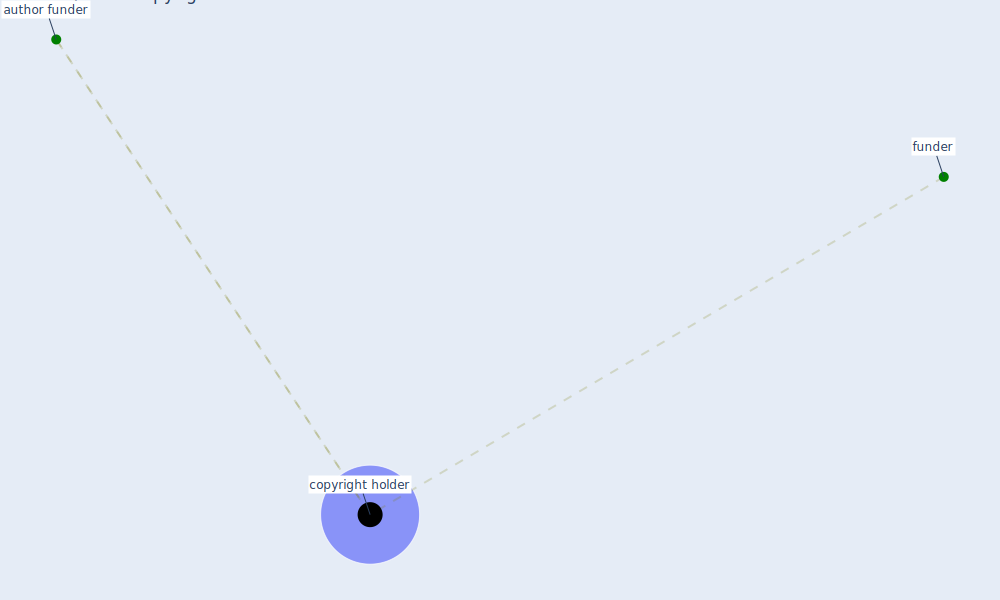

# Keyword: copyright holder

## Keywords

 * [author funder](keyword_author_funder), [copyright holder](keyword_copyright_holder), funder

## Mapping

## Neighbours

### Closest articles

* Green spaces, especially forest, linked to lower SARS-CoV-2 infection rates: A one-year nationwide study - [LINK](article_jiang_green_2021)
* The removal of airborne SARS-CoV-2 and other microbial bioaerosols by air filtration on COVID-19 surge units - [LINK](article_conway-morris_removal_2021)
* Toilets dominate environmental detection of SARS-CoV-2 virus in a hospital - [LINK](article_ding_toilets_2020)
* A Continuously Active Antimicrobial Coating effective against Human Coronavirus 229E - [LINK](article_ikner_continuously_2020)
* Understanding the role of urban design in disease spreading - [LINK](article_brizuela_understanding_2019)
* Open-source analytics tools for studying the COVID-19 coronavirus outbreak - [LINK](article_wu_open-source_2020)

### Closest BPs

