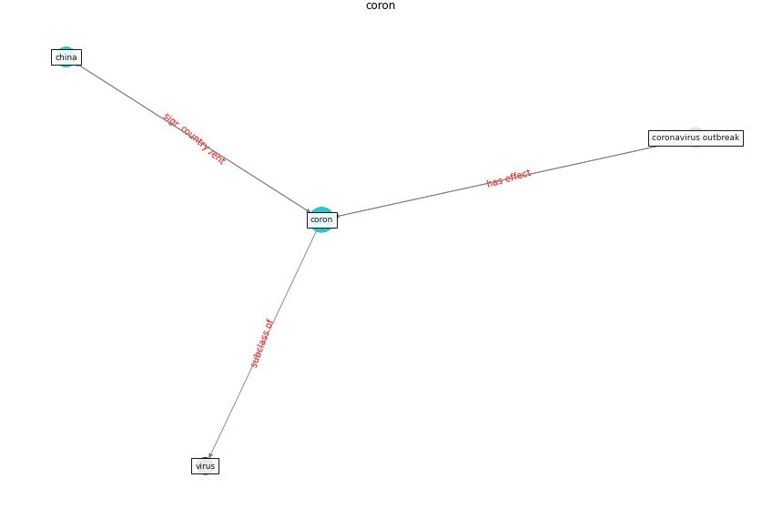

# Keyword: coron

* [surveying-mapping](cluster_Cluster_10)

## Keywords

 * Cluster_10, [china](keyword_china), [coron](keyword_coron), [coronavirus outbreak](keyword_coronavirus_outbreak), [virus](keyword_virus)

## Concepts

 

## Neighbours

### Closest articles

* China adapts survey drones to enforce world’s largest quarantine - [LINK](article_liu_china_2020)
* Pandemic Analytics: How Countries are Leveraging Big Data Analytics and Artificial Intelligence to Fight COVID-19? - [LINK](article_mehta_pandemic_2021)

### Closest BPs

