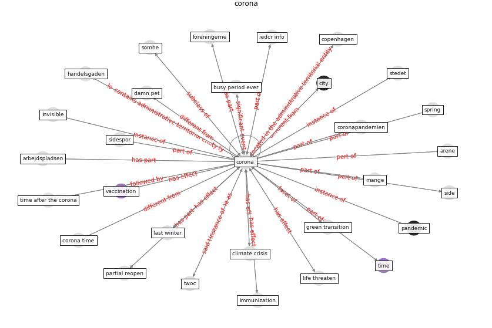

# Keyword: __corona__
## Clusters

* Cluster 2: [construction-resilience](cluster_2.md)

## Concepts

 

## Articles
* realdania_refleksioner_2022_EN ([realdania_refleksioner_2022_EN](article_realdania_refleksioner_2022_EN.md))
* What drives unverified information sharing and
cyberchondria during the COVID-19 pandemic? ([laato_what_2020](article_laato_what_2020.md))
* The COVID-19 epidemiology and monitoring ontology ([queralt-rosinach_covid-19_2021](article_queralt-rosinach_covid-19_2021.md))
* realdania_refleksioner_2022-400 ([realdania_refleksioner_2022-400](article_realdania_refleksioner_2022-400.md))
* Internet of things (IoT) applications to fight against
COVID-19 pandemic ([singh_internet_2020](article_singh_internet_2020.md))
* realdania_refleksioner_2022-550 ([realdania_refleksioner_2022-550](article_realdania_refleksioner_2022-550.md))
* realdania_refleksioner_2022-600 ([realdania_refleksioner_2022-600](article_realdania_refleksioner_2022-600.md))
* Graphene-based nanomaterials as antimicrobial surface
coatings: A parallel approach to restrain the expansion
of COVID-19 ([ayub_graphene-based_2021](article_ayub_graphene-based_2021.md))
* realdania_refleksioner_2022-650 ([realdania_refleksioner_2022-650](article_realdania_refleksioner_2022-650.md))
* Revisiting the built environment: 10 potential development
changes and paradigm shifts due to COVID-19 ([cheshmehzangi_revisiting_2021](article_cheshmehzangi_revisiting_2021.md))
