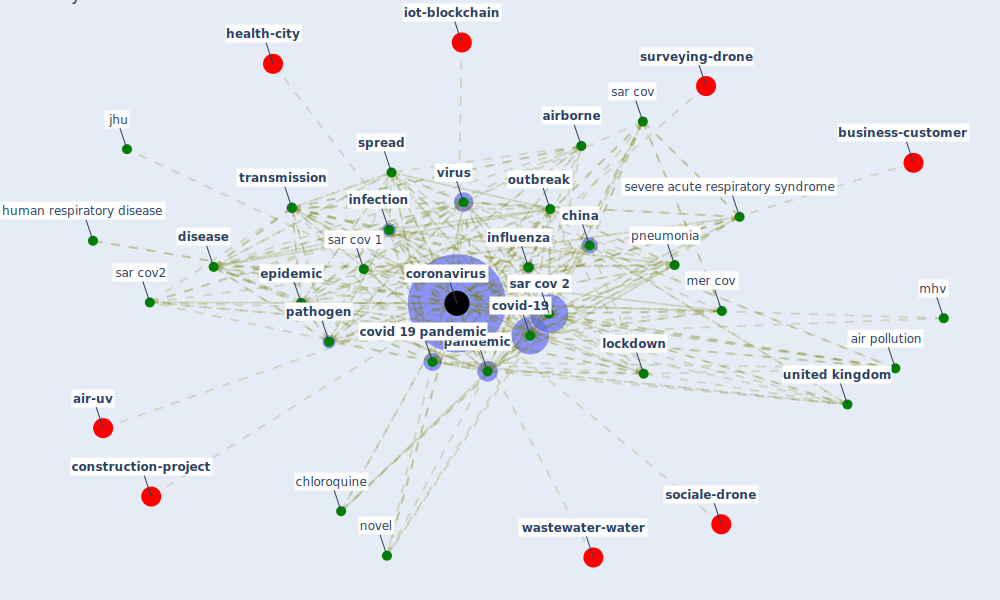

# Keyword: coronavirus

* [health-city](cluster_0)

* [wastewater-water](cluster_1)

* [iot-blockchain](cluster_6)

* [construction-project](cluster_7)

* [air-uv](cluster_8)

* [business-customer](cluster_10)

* [surveying-drone](cluster_11)

* [sociale-drone](cluster_13)

## Keywords

 * 229e, [air pollution](keyword_air_pollution), [airborne](keyword_airborne), alpha hcov 229e, architecture after coronavirus, architecture after the coronavirus, [australia](keyword_australia), bat, beta hcov oc43, business after coronavirus, c ovid, cardiac complication, [cdc](keyword_cdc), [china](keyword_china), [chinese](keyword_chinese), chloroquine, [climate change](keyword_climate_change), cobid 19, colombia, communication I dium, coronamelder, coronaviridae, [coronavirus](keyword_coronavirus), coronavirus case, coronavirus disease, coronavirus disease covid 19 pandemic, coronavirus pandemic, covid 19 disease, covid 19 infection, [covid 19 pandemic](keyword_covid_19_pandemic), [covid-19](keyword_covid-19), current, [disease](keyword_disease), envelop virus, [epidemic](keyword_epidemic), [genome](keyword_genome), hcov oc43, hepatitis virus, [hong kong](keyword_hong_kong), [human](keyword_human), human respiratory disease, human respiratory disease in china, [infect](keyword_infect), [infection](keyword_infection), [infectious](keyword_infectious), [influenza](keyword_influenza), [influenza virus](keyword_influenza_virus), isolation, jhu, [kenya](keyword_kenya), [lockdown](keyword_lockdown), lockdown locali, [mer cov](keyword_mer_cov), mhv, middle east respiratory syndrome, middle east respiratory syndrome coronavirus, mouse hepatitis virus, [new york](keyword_new_york), [new york city](keyword_new_york_city), novel, novel coronavirus, oc43, [outbreak](keyword_outbreak), [pandemic](keyword_pandemic), [pathogen](keyword_pathogen), pneumonia, pneumonia outbreak, present pandemic, protein, [public health](keyword_public_health), [quarantine](keyword_quarantine), ratg13, reshape city street, respiratory disease, rethink where they want to live, ride sharing, rna virus, rt pcr, sar cov, [sar cov 1](keyword_sar_cov_1), [sar cov 2](keyword_sar_cov_2), sar cov 2 virus, [sar cov2](keyword_sar_cov2), sars coronavirus, second wave, serbia, severe acute respiratory syndrome, severe acute respiratory syndrome coronavirus 2, [south korea](keyword_south_korea), [spread](keyword_spread), the spread, tourist, [transmission](keyword_transmission), transmission rate, [ultraviolet](keyword_ultraviolet), [united kingdom](keyword_united_kingdom), [vaccine](keyword_vaccine), [viral](keyword_viral), [virus](keyword_virus), world after coronavirus

## Mapping

## Neighbours

### Closest articles

* How COVID-19 Could Accelerate the Adoption of New Retail Technologies and Enhance the (E-)Servicescape - [LINK](article_willems_how_2021)
* A Comprehensive Review of the COVID-19 Pandemic and the Role of IoT, Drones, AI, Blockchain, and 5G in Managing its Impact - [LINK](article_chamola_comprehensive_2020)
* Far-UVC light (222 nm) efficiently and safely inactivates airborne human coronaviruses - [LINK](article_buonanno_far-uvc_2020)
* Pandemic Analytics: How Countries are Leveraging Big Data Analytics and Artificial Intelligence to Fight COVID-19? - [LINK](article_mehta_pandemic_2021)
* Effects of temperature and humidity on the spread of COVID-19: A systematic review - [LINK](article_mecenas_effects_2020)
* Persistence of coronaviruses on inanimate surfaces and their inactivation with biocidal agents - [LINK](article_kampf_persistence_2020)
* Upper-room ultraviolet air disinfection might help to reduce COVID-19 transmission in buildings: a feasibility study - [LINK](article_beggs_upper-room_2020)
* COVID-19 Pandemic: Prevention and Protection Measures to Be Adopted at the Workplace - [LINK](article_cirrincione_covid-19_2020)
* Guidelines for Responding to COVID-19 Pandemic: Best Practices, Impacts, and Future Research Directions - [LINK](article_assaad_guidelines_2021)
* 2019 Novel Coronavirus (COVID-19) Pandemic: Built Environment Considerations To Reduce Transmission - [LINK](article_dietz_2019_2020)

### Closest BPs

