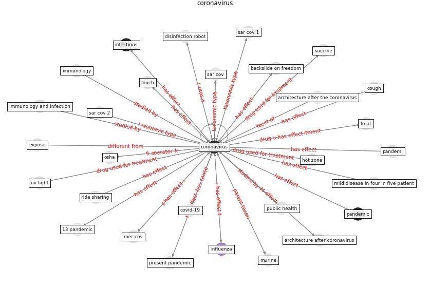

# Keyword: __coronavirus__
## Clusters

* Cluster 1: [datum-health](cluster_1)
* Cluster 3: [health-city](cluster_3)
* Cluster 7: [climate-change](cluster_7)

## Concepts

 

## Articles
* A Comprehensive Review of the COVID-19 Pandemic
and the Role of IoT, Drones, AI, Blockchain, and
5G in Managing its Impact ([chamola_comprehensive_2020](article_chamola_comprehensive_2020))
* Far-UVC light (222 nm) efficiently and safely
inactivates airborne human coronaviruses ([buonanno_far-uvc_2020](article_buonanno_far-uvc_2020))
* Effects of temperature and humidity on the spread of
COVID-19: A systematic review ([mecenas_effects_2020](article_mecenas_effects_2020))
* Pandemic Analytics: How Countries are Leveraging
Big Data Analytics and Artificial Intelligence to
Fight COVID-19? ([mehta_pandemic_2021](article_mehta_pandemic_2021))
* Persistence of coronaviruses on inanimate surfaces and
their inactivation with biocidal agents ([kampf_persistence_2020](article_kampf_persistence_2020))
* Guidelines for Responding to COVID-19 Pandemic:
Best Practices, Impacts, and Future Research
Directions ([assaad_guidelines_2021](article_assaad_guidelines_2021))
* Upper-room ultraviolet air disinfection might help to
reduce COVID-19 transmission in buildings: a feasibility
study ([beggs_upper-room_2020](article_beggs_upper-room_2020))
* 2019 Novel Coronavirus (COVID-19) Pandemic:
Built Environment Considerations To Reduce
Transmission ([dietz_2019_2020](article_dietz_2019_2020))
* The socio-economic implications of the coronavirus
pandemic (COVID-19): A review ([nicola_socio-economic_2020](article_nicola_socio-economic_2020))
* Coronavirus questions that will not go away: interrogating
urban and socio-spatial implications of COVID-19
measures ([salama_coronavirus_2020](article_salama_coronavirus_2020))
