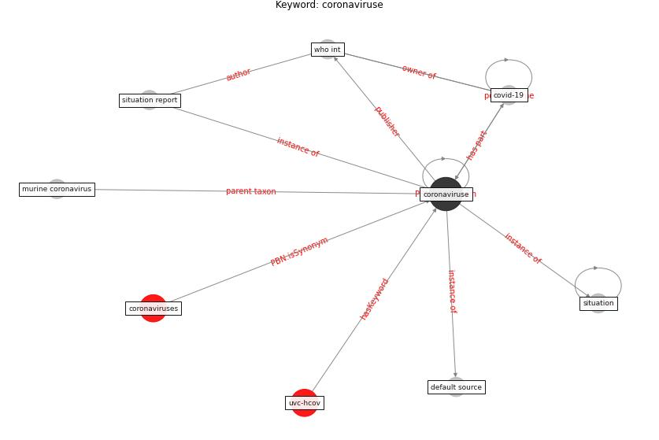

# Keyword: __coronaviruse__
## Clusters

* Cluster 11: [surface-coating](cluster_11)

## Concepts

 

## Articles
* WHO-2019-nCoV-Urban_preparedness-2020 ([WHO-2019-nCoV-Urban_preparedness-2020](article_WHO-2019-nCoV-Urban_preparedness-2020))
* Recently employed engineering techniques to reduce the
spread of COVID-19 (corona virus disease 2019): a review
study ([saman_recently_2021](article_saman_recently_2021))
* A Comprehensive Review of the COVID-19 Pandemic
and the Role of IoT, Drones, AI, Blockchain, and
5G in Managing its Impact ([chamola_comprehensive_2020](article_chamola_comprehensive_2020))
* Social distancing enhanced automated optimal design of
physical spaces in the wake of the COVID-19 pandemic ([ugail_social_2021](article_ugail_social_2021))
* Amplifying the role of knowledge translation platforms in
the COVID-19 pandemic response ([el-jardali_amplifying_2020](article_el-jardali_amplifying_2020))
* SARS-CoV-2 in wastewater: potential health risk, but
also data source ([lodder_sars-cov-2_2020](article_lodder_sars-cov-2_2020))
* A Comprehensive Review of the COVID-19 Pandemic
and the Role of IoT, Drones, AI, Blockchain, and
5G in Managing its Impact ([chamola_comprehensive_2020](article_chamola_comprehensive_2020))
* Rapid expansion of temporary, reliable airborne-infection
isolation rooms with negative air machines for critical
COVID-19 patients ([lee_rapid_2020](article_lee_rapid_2020))
* The Socio-Spatial Determinants of COVID-19
Diffusion: The Impact of Globalisation,
Settlement Characteristics and Population ([sigler_socio-spatial_2020](article_sigler_socio-spatial_2020))
* A Comprehensive Review of the COVID-19 Pandemic
and the Role of IoT, Drones, AI, Blockchain, and
5G in Managing its Impact ([chamola_comprehensive_2020](article_chamola_comprehensive_2020))
