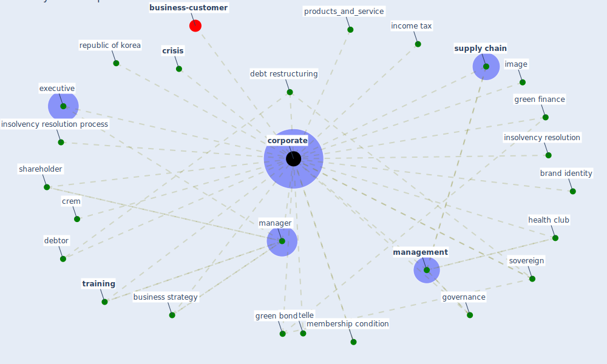

# Keyword: corporate

* [business-customer](cluster_11)

## Keywords

 * Cluster_11, brand identity, business strategy, [corporate](keyword_corporate), corporates, crem, [crisis](keyword_crisis), debt restructuring, debtor, executive, governance, green bond, green finance, [health club](keyword_health_club), image, income tax, insolvency resolution, insolvency resolution process, [management](keyword_management), [manager](keyword_manager), membership condition, products_and_service, republic of korea, shareholder, sovereign, storytelle, [supply chain](keyword_supply_chain), [training](keyword_training)

## Mapping

## Neighbours

### Closest articles

* World Bank Development Report - [LINK](article_world_bank_world_2022)
* A study on office workplace modification during the COVID-19 pandemic in The Netherlands - [LINK](article_hou_study_2021)
* How COVID-19 Could Accelerate the Adoption of New Retail Technologies and Enhance the (E-)Servicescape - [LINK](article_willems_how_2021)
* Assessment of COVID-19 precautionary measures in sports facilities: A case study on a health club in Saudi Arabia - [LINK](article_ibrahim_assessment_2022)
* On the Coronavirus (COVID-19) Outbreak and the Smart City Network: Universal Data Sharing Standards Coupled with Artificial Intelligence (AI) to Benefit Urban Health Monitoring and Management - [LINK](article_allam_coronavirus_2020)
* Health, Wellbeing \& Productivity in Offices - [LINK](article_world_green_building_council_health_2014)
* Mapping research in logistics and supply chain management during COVID-19 pandemic - [LINK](article_montoya-torres_mapping_2021)
* The three modes of existence of the pandemic smart city - [LINK](article_soderstrom_three_2021)
* Impact of COVID-19 on IoT Adoption in Healthcare, Smart Homes, Smart Buildings, Smart Cities, Transportation and Industrial IoT - [LINK](article_umair_impact_2021)

### Closest BPs

