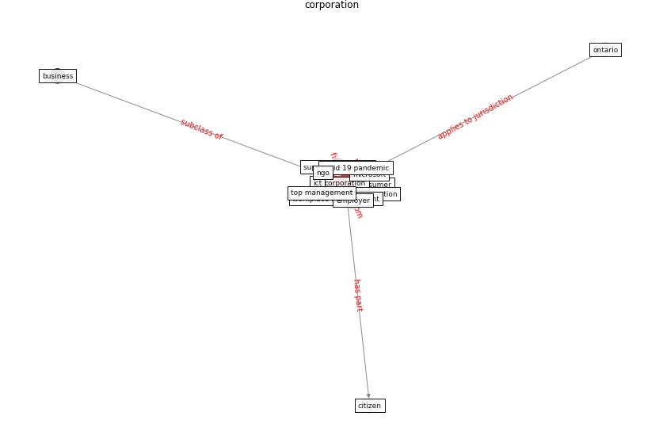

# Keyword: corporation

* [airport-coating](cluster_Cluster_6)

## Keywords

 * Cluster_6, [business](keyword_business), citizen, [consumer](keyword_consumer), [corporation](keyword_corporation), corporations, [covid 19 pandemic](keyword_covid_19_pandemic), debt, [employer](keyword_employer), geography, ict, [industry](keyword_industry), microsoft, ngo, [ontario](keyword_ontario), [organisation](keyword_organisation), profit generation, public asset management company, sovereign debt, statutory body, supportive housing, territory, too big to fail, top management, [workplace management](keyword_workplace_management)

## Concepts

 

## Neighbours

### Closest articles

* A study on office workplace modification during the COVID-19 pandemic in The Netherlands - [LINK](article_hou_study_2021)
* On the Coronavirus (COVID-19) Outbreak and the Smart City Network: Universal Data Sharing Standards Coupled with Artificial Intelligence (AI) to Benefit Urban Health Monitoring and Management - [LINK](article_allam_coronavirus_2020)
* The three modes of existence of the pandemic smart city - [LINK](article_soderstrom_three_2021)
* World Bank Development Report - [LINK](article_world_bank_world_2022)
* Eviction, Health Inequity, and the Spread of COVID-19: Housing Policy as a Primary Pandemic Mitigation Strategy - [LINK](article_benfer_eviction_2021)
* How COVID-19 Could Accelerate the Adoption of New Retail Technologies and Enhance the (E-)Servicescape - [LINK](article_willems_how_2021)
* Future (post-COVID) digital, smart and sustainable cities in the wake of 6G: Digital twins, immersive realities and new urban economies - [LINK](article_allam_future_2021)
* Analysis of COVID-19 Concerns Raised by the Construction Workforce and Development of Mitigation Practices - [LINK](article_bou_hatoum_analysis_2021)
* How COVID-19 Redefines the Concept of Sustainability - [LINK](article_hakovirta_how_2020)

### Closest BPs

