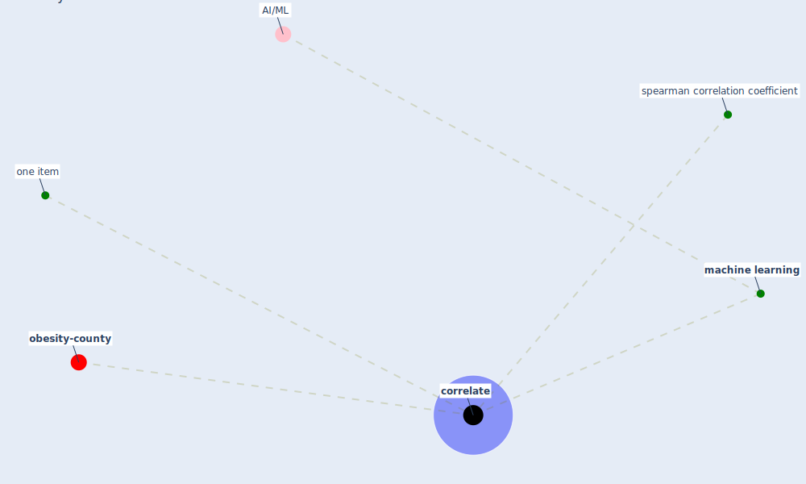

# Keyword: correlate

* [obesity-county](cluster_9)

## Keywords

 * Cluster_9, [correlate](keyword_correlate), correlated, [machine learning](keyword_machine_learning), one item, spearman correlation coefficient

## Mapping

## Neighbours

### Closest articles

* The Effect of Opening Windows on Air Change Rates in Two Homes - [LINK](article_howard-reed_effect_2002)
* The Intelligent Lockdown: Compliance with COVID-19 Mitigation Measures in the Netherlands - [LINK](article_kuiper_intelligent_2020)
* Compliance with COVID-19 Mitigation Measures in the United States - [LINK](article_van_rooij_compliance_2020)
* A Comprehensive Review of the COVID-19 Pandemic and the Role of IoT, Drones, AI, Blockchain, and 5G in Managing its Impact - [LINK](article_chamola_comprehensive_2020)

### Closest BPs

