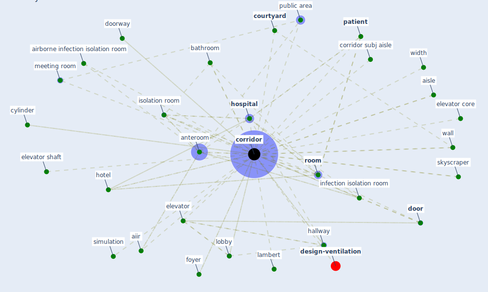

# Keyword: corridor

* [design-ventilation](cluster_12)

## Keywords

 * Cluster_12, [aiir](keyword_aiir), airborne infection isolation room, aisle, [anteroom](keyword_anteroom), atria, bathroom, bench, [corridor](keyword_corridor), corridor subj aisle, corridors, [courtyard](keyword_courtyard), cylinder, [door](keyword_door), doorway, elevator, elevator cabin, elevator core, elevator shaft, foyer, garage, hallway, [hospital](keyword_hospital), hotel, infection isolation room, isolation room, lambert, lobby, meet room, meeting room, nook, partition, passage, [patient](keyword_patient), patient corridor, pe room, public area, [room](keyword_room), safety reason, share anteroom, [simulation](keyword_simulation), skyscraper, stairwell, wake, wall, width

## Mapping

## Neighbours

### Closest articles

* A Review on Building Design as a Biomedical System for Preventing COVID-19 Pandemic - [LINK](article_amran_review_2022)
* Rapid expansion of temporary, reliable airborne-infection isolation rooms with negative air machines for critical COVID-19 patients - [LINK](article_lee_rapid_2020)
* The ventilation of buildings and other mitigating measures for COVID-19: a focus on wintertime - [LINK](article_burridge_ventilation_2021)
* Architectural design strategies for infection prevention and control (IPC) in health-care facilities: towards curbing the spread of Covid-19 \textbar SpringerLink - [LINK](article_udomiaye_architectural_2020)
* Designing for COVID-2x: Reflecting on Future-Proofing Human Habitation for the Inevitable Next Pandemic - [LINK](article_spennemann_designing_2022)
* Prophylactic Architecture: Formulating the Concept of Pandemic-Resilient Homes - [LINK](article_elrayies_prophylactic_2022)
* Building occupancy estimation with people flow modeling in AnyLogic - [LINK](article_li_building_2016)
* Assessment of COVID-19 precautionary measures in sports facilities: A case study on a health club in Saudi Arabia - [LINK](article_ibrahim_assessment_2022)
* The Impact of COVID-19 on Public Space: A Review of the Emerging Questions - [LINK](article_honey-roses_impact_2020)
* A critical review of heating, ventilation, and air conditioning (HVAC) systems within the context of a global SARS-CoV-2 epidemic - [LINK](article_elsaid_critical_2021)

### Closest BPs

