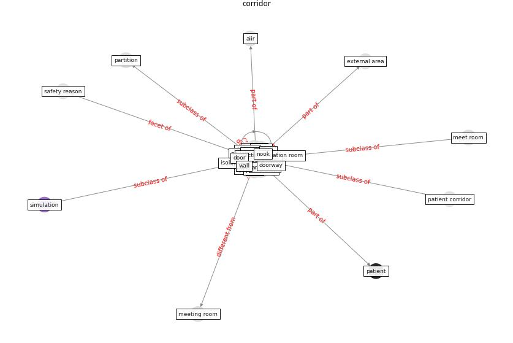

# Keyword: __corridor__

## Concepts

 

## Top articles for __corridor__
* Rapid expansion of temporary, reliable airborne-infection
isolation rooms with negative air machines for critical
COVID-19 patients ([lee_rapid_2020](article_lee_rapid_2020))
* Air, Surface Environmental, and Personal
Protective Equipment Contamination by Severe
Acute Respiratory Syndrome Coronavirus 2
(SARS-CoV-2) From a Symptomatic Patient ([ong_air_2020](article_ong_air_2020))
* yan_10_2020 ([yan_10_2020](article_yan_10_2020))
