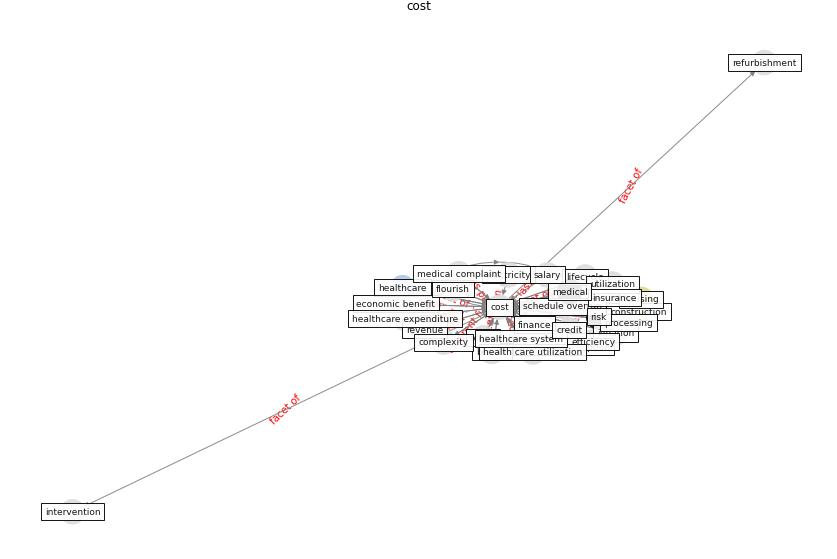

# Keyword: __cost__
## Clusters

* Cluster 3: [construction-project](cluster_3.md)

## Concepts

 

## Articles
* Overcoming the Impact of COVID-19 Using Integrated
Project Delivery Model ([g_overcoming_2020](article_g_overcoming_2020.md))
* Mechanisms for addressing the impact of COVID-19 on
infrastructure projects ([king_mechanisms_2021](article_king_mechanisms_2021.md))
* Global value chains: Efficiency and risks in the context
of COVID-19 ([oecd_global_2021](article_oecd_global_2021.md))
* Scalable IoT Architecture for Monitoring IEQ
Conditions in Public and Private Buildings ([calvo_scalable_2022](article_calvo_scalable_2022.md))
* Analysis of COVID-19 Concerns Raised by the
Construction Workforce and Development of
Mitigation Practices ([bou_hatoum_analysis_2021](article_bou_hatoum_analysis_2021.md))
* Mental health economics: A prospective study on
psychological flourishing and associations with healthcare
costs and sickness benefit transfers in Denmark ([santini_mental_2021](article_santini_mental_2021.md))
* Perception of COVID-19 impacts on the construction
industry over time ([rokooei_perception_2022](article_rokooei_perception_2022.md))
* Graphene-based nanomaterials as antimicrobial surface
coatings: A parallel approach to restrain the expansion
of COVID-19 ([ayub_graphene-based_2021](article_ayub_graphene-based_2021.md))
* Designing Post COVID-19 Buildings: Approaches for
Achieving Healthy Buildings ([navaratnam_designing_2022](article_navaratnam_designing_2022.md))
* DeepSOCIAL: Social Distancing Monitoring and
Infection Risk Assessment in COVID-19 Pandemic ([rezaei_deepsocial_2020](article_rezaei_deepsocial_2020.md))
