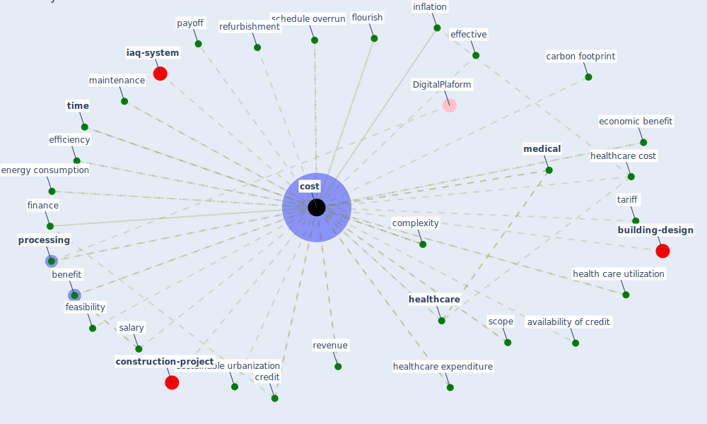

# Keyword: cost

* [building-design](cluster_3)

* [construction-project](cluster_5)

* [iaq-system](cluster_8)

## Keywords

 * Cluster_3, Cluster_8, availability of credit, benefit, benefits accrue with time, build bybuilding, building by build, carbon footprint, complexity, [construction](keyword_construction), [contract](keyword_contract), contractor income, [cost](keyword_cost), cost benefit, cost component, cost effective, cost of crisis, cost of live, cost of these sensor, cost of treat patient, cost planning, costconversion, costeffectiveness, costing, costisassociated, costs, credit, datum management, difficulty, [economic](keyword_economic), economic benefit, economic dimension, effective, effectiveness, efficiency, [energy consumption](keyword_energy_consumption), expense, feasibility, finance, [flourish](keyword_flourish), health care utilization, [healthcare](keyword_healthcare), [healthcare cost](keyword_healthcare_cost), healthcare expenditure, [healthcare system](keyword_healthcare_system), [housing](keyword_housing), [impact](keyword_impact), inflation, integrated planning, kaizen, labor, life cycle, life cycle cost, lifecycle, lifecycle cost, lifetime, [live](keyword_live), maintenance, maintenance cost, [manufacture](keyword_manufacture), [medical](keyword_medical), network server, new build, non operability, outcome, payoff, performance, [physical](keyword_physical), point estimate, [processing](keyword_processing), product, profit center, [project](keyword_project), [public health](keyword_public_health), refurbishment, retail price, revenue, [risk](keyword_risk), salary, schedule overrun, scope, signal, size, sovereign default, [sustainability](keyword_sustainability), sustainable urbanization, sustainable work policy, tariff, threshold level, [time](keyword_time), time overrun, time relate cost, treat patient, [treatment](keyword_treatment), uncertainty, urban infrastructure, utilization, ventilation rate, wage, waste

## Mapping

## Neighbours

### Closest articles

* Mental health economics: A prospective study on psychological flourishing and associations with healthcare costs and sickness benefit transfers in Denmark - [LINK](article_santini_mental_2021)
* Overcoming the Impact of COVID-19 Using Integrated Project Delivery Model - [LINK](article_g_overcoming_2020)
* Health, Wellbeing \& Productivity in Offices - [LINK](article_world_green_building_council_health_2014)
* World Bank Development Report - [LINK](article_world_bank_world_2022)
* Addressing vulnerability, building resilience: community-based adaptation to vector-borne diseases in the context of global change - [LINK](article_bardosh_addressing_2017)
* Mechanisms for addressing the impact of COVID-19 on infrastructure projects - [LINK](article_king_mechanisms_2021)
* Global value chains: Efficiency and risks in the context of COVID-19 - [LINK](article_oecd_global_2021)
* The effect of a redesigned floor plan, occupant density and the quality of indoor climate on the cost of space, productivity and sick leave in an office building–A case study - [LINK](article_saari_effect_2006)
* The role of green roofs in post COVID-19 confinement: An analysis of willingness to pay - [LINK](article_manso_role_2021)
* Mapping research in logistics and supply chain management during COVID-19 pandemic - [LINK](article_montoya-torres_mapping_2021)

### Closest BPs

