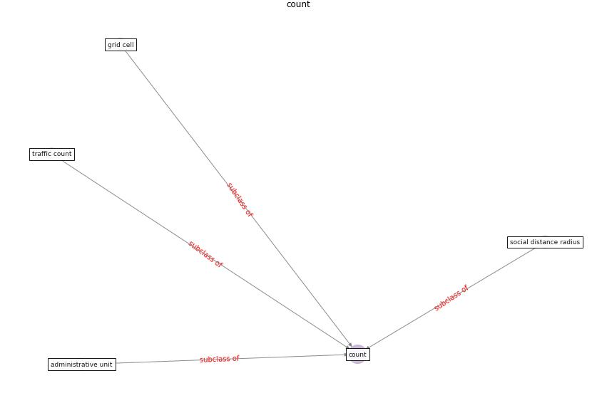

# Keyword: __count__
## Clusters

* Cluster 7: [liver-province](cluster_7)

## Concepts

 

## Top 10 articles for __count__
* EXPOSED: An occupant exposure model for confined
spaces to retrofit crowd models during a pandemic ([ronchi_exposed_2020](article_ronchi_exposed_2020))
* COVID-19 Higher Mortality in Chinese Regions
With Chronic Exposure to Lower Air Quality ([pansini_covid-19_2021](article_pansini_covid-19_2021))
* DeepSOCIAL: Social Distancing Monitoring and
Infection Risk Assessment in COVID-19 Pandemic ([rezaei_deepsocial_2020](article_rezaei_deepsocial_2020))
* realdania_refleksioner_2022_EN ([realdania_refleksioner_2022_EN](article_realdania_refleksioner_2022_EN))
* Digital Twin of COVID-19 Mass Vaccination
Centers ([pilati_digital_2021](article_pilati_digital_2021))
* COVID-19 Experience Transforming the Protective
Environment of Office Buildings and Spaces ([phapant_covid-19_2021](article_phapant_covid-19_2021))
* Mental Health and the Covid-19 Pandemic ([pfefferbaum_mental_2020](article_pfefferbaum_mental_2020))
* How our homes impact our health: using a COVID-19
informed approach to examine urban apartment housing ([peters_how_2020](article_peters_how_2020))
* Assessment of Building Automation and Control
Systems in Danish Healthcare Facilities in the
COVID-19 Era ([pedersen_assessment_2022](article_pedersen_assessment_2022))
* RUDDS_bioRxiv_update ([RUDDS_bioRxiv_update](article_RUDDS_bioRxiv_update))
