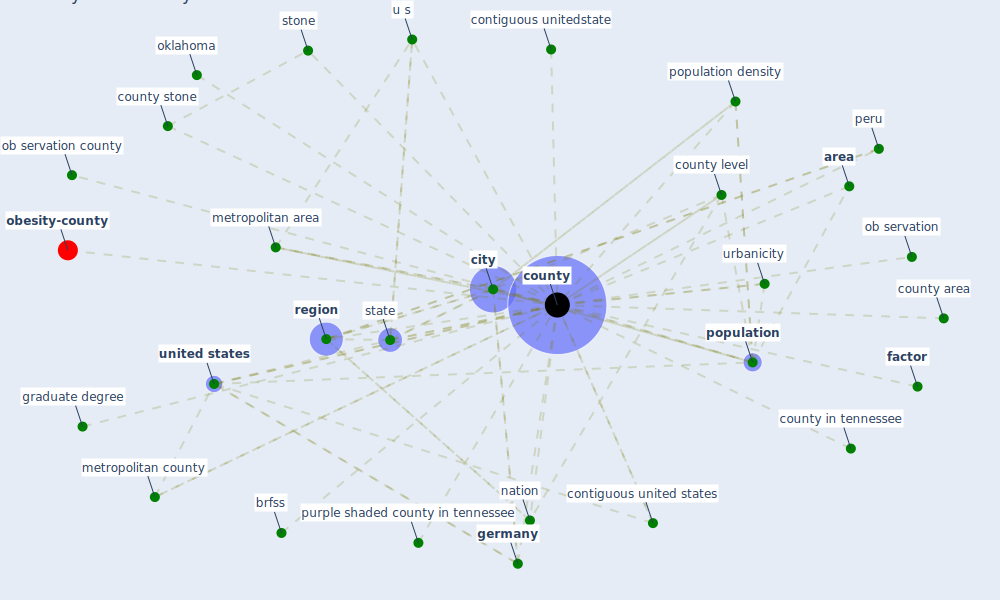

# Keyword: county

* [obesity-county](cluster_9)

## Keywords

 * Cluster_9, [area](keyword_area), brfss, [city](keyword_city), contiguous united states, contiguous unitedstate, counties, [county](keyword_county), county area, county in tennessee, county level, county stone, [factor](keyword_factor), forest exposure level, [germany](keyword_germany), graduate degree, metropolitan area, metropolitan county, nation, ob servation, ob servation county, oklahoma, [peru](keyword_peru), [population](keyword_population), population density, purple shaded county in tennessee, [region](keyword_region), [state](keyword_state), stone, u s, [united states](keyword_united_states), urbanicity

## Mapping

## Neighbours

### Closest articles

* Treating two pandemics for the price of one: Chronic and infectious disease impacts of the built and natural environment - [LINK](article_frank_treating_2021)
* Green spaces, especially forest, linked to lower SARS-CoV-2 infection rates: A one-year nationwide study - [LINK](article_jiang_green_2021)
* A Review on Building Design as a Biomedical System for Preventing COVID-19 Pandemic - [LINK](article_amran_review_2022)
* The Role of Architecture and Urbanism in Preventing Pandemics - [LINK](article_kumar_role_2021)
* Respiratory pandemics, urban planning and design: A multidisciplinary rapid review of the literature - [LINK](article_harris_respiratory_2022)
* COVID-19 and Green Housing: A Review of Relevant Literature - [LINK](article_kaklauskas_covid-19_2021)
* COVID-19 and the rise of intimate partner violence - [LINK](article_aguero_covid-19_2021)
* Readiness Assessment of Green Building Certification Systems for Residential Buildings during Pandemics - [LINK](article_tleuken_readiness_2021)
* The socio-economic determinants of COVID-19: A spatial analysis of German county level data - [LINK](article_ehlert_socio-economic_2021)

### Closest BPs

