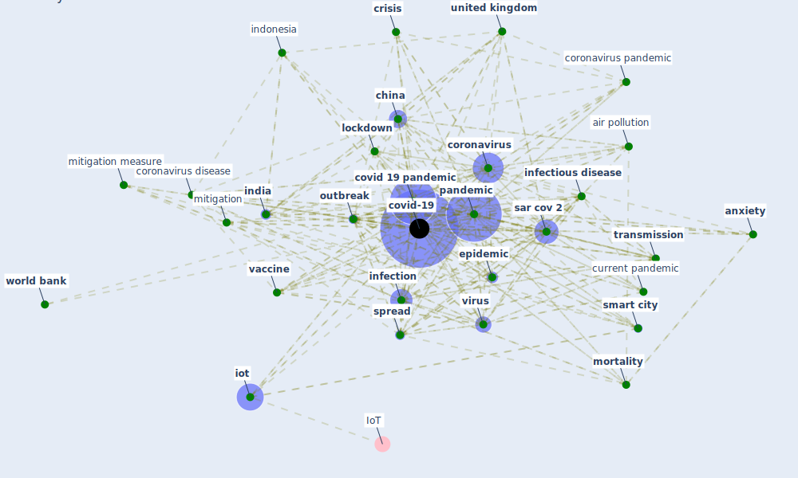

# Keyword: covid-19

## Keywords

 * [5 g](keyword_5_g), SARS-CoV-2, [aerosol](keyword_aerosol), [air pollution](keyword_air_pollution), airborne transmission, [anxiety](keyword_anxiety), [apc](keyword_apc), [artificial intelligence](keyword_artificial_intelligence), [australia](keyword_australia), be attribute, [china](keyword_china), [city](keyword_city), [climate change](keyword_climate_change), [confinement](keyword_confinement), [construction](keyword_construction), [construction industry](keyword_construction_industry), contact trace, containment, [coronavirus](keyword_coronavirus), coronavirus disease, coronavirus pandemic, covid 19 outbreak, [covid 19 pandemic](keyword_covid_19_pandemic), [covid-19](keyword_covid-19), [crisis](keyword_crisis), current pandemic, [cyberchondria](keyword_cyberchondria), e commerce, [economic crisis](keyword_economic_crisis), egypt, [epidemic](keyword_epidemic), [epidemiological](keyword_epidemiological), [europe](keyword_europe), [green building](keyword_green_building), [green housing](keyword_green_housing), health crisis, [hvac](keyword_hvac), [impact](keyword_impact), [india](keyword_india), [indonesia](keyword_indonesia), inequality, [infection](keyword_infection), [infectious disease](keyword_infectious_disease), [influenza](keyword_influenza), infrastructure resilience, [iot](keyword_iot), [ipc](keyword_ipc), [italy](keyword_italy), [japan](keyword_japan), [lockdown](keyword_lockdown), [london](keyword_london), [loneliness](keyword_loneliness), [mitigation](keyword_mitigation), mitigation measure, mobility report, [mortality](keyword_mortality), [nigeria](keyword_nigeria), [obesity](keyword_obesity), ongoing pandemic, [ontology](keyword_ontology), [openkg](keyword_openkg), [openkg covid19](keyword_openkg_covid19), [osha](keyword_osha), [outbreak](keyword_outbreak), [pandemic](keyword_pandemic), pandemic crisis, [pandemien](keyword_pandemien), pedestrian navigation service, post covid 19, post-pandemic, [public health](keyword_public_health), [quarantine](keyword_quarantine), [risk](keyword_risk), [sar cov 2](keyword_sar_cov_2), sar cov 2 rna, [sdgs](keyword_sdgs), severe acute respiratory syndrome coronavirus 2, [smart building](keyword_smart_building), [smart city](keyword_smart_city), [sme](keyword_sme), [spread](keyword_spread), [sustainability](keyword_sustainability), [symptom](keyword_symptom), the pandemic, [transmission](keyword_transmission), travel anxiety, [treatment](keyword_treatment), turkey, [tvet](keyword_tvet), [united kingdom](keyword_united_kingdom), [united states](keyword_united_states), unverified, [vaccine](keyword_vaccine), [ventilation](keyword_ventilation), vietnam, [virus](keyword_virus), who int, [world bank](keyword_world_bank), worldwide pandemic, [wuhan](keyword_wuhan)

## Mapping

## Neighbours

### Closest articles

* Impact of COVID-19 on IoT Adoption in Healthcare, Smart Homes, Smart Buildings, Smart Cities, Transportation and Industrial IoT - [LINK](article_umair_impact_2021)
* How COVID-19 Could Accelerate the Adoption of New Retail Technologies and Enhance the (E-)Servicescape - [LINK](article_willems_how_2021)
* A Comprehensive Review of the COVID-19 Pandemic and the Role of IoT, Drones, AI, Blockchain, and 5G in Managing its Impact - [LINK](article_chamola_comprehensive_2020)
* A critical review of heating, ventilation, and air conditioning (HVAC) systems within the context of a global SARS-CoV-2 epidemic - [LINK](article_elsaid_critical_2021)
* World Bank Development Report - [LINK](article_world_bank_world_2022)
* Urban planning after COVID-19 - [LINK](article_rtpi_urban_2021)
* COVID-19 Experience Transforming the Protective Environment of Office Buildings and Spaces - [LINK](article_phapant_covid-19_2021)
* A critical analysis of the impacts of COVID-19 on the global economy and ecosystems and opportunities for circular economy strategies - [LINK](article_ibn-mohammed_critical_2021)
* Pandemic Analytics: How Countries are Leveraging Big Data Analytics and Artificial Intelligence to Fight COVID-19? - [LINK](article_mehta_pandemic_2021)
* Urban Community Sustainable Development Patterns under the Influence of COVID-19: A Case Study Based on the Non-Contact Interaction Perspective of Hangzhou City - [LINK](article_wang_urban_2021)

### Closest BPs

