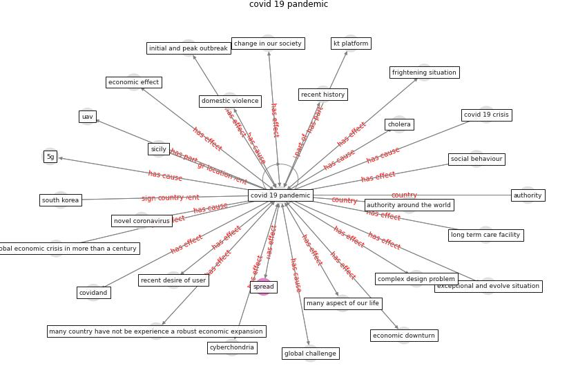

# Keyword: __covid 19 pandemic__

## Concepts

 

## Top articles for __covid 19 pandemic__
* yan_10_2020 ([yan_10_2020](article_yan_10_2020))
* Ten questions concerning occupant health in buildings
during normal operations and extreme events including the
COVID-19 pandemic ([awada_ten_2021](article_awada_ten_2021))
* Towards Resilient Residential Buildings and
Neighborhoods in Light of COVID-19 Pandemic—The
Scenario of Podgorica, Montenegro ([bojovic_towards_2022](article_bojovic_towards_2022))
* Learning from the COVID-19 pandemic in governing smart
cities ([bolivar_learning_2022](article_bolivar_learning_2022))
* COVID-19 media fatigue: predictors of decreasing
interest and avoidance of COVID-19–related news ([buneviciene_covid-19_2021](article_buneviciene_covid-19_2021))
* A Comprehensive Review of the COVID-19 Pandemic
and the Role of IoT, Drones, AI, Blockchain, and
5G in Managing its Impact ([chamola_comprehensive_2020](article_chamola_comprehensive_2020))
* Home garden use during COVID-19: Associations with
physical and mental wellbeing in older adults ([corley_home_2021](article_corley_home_2021))
* COVID-19 and Living space challenge. Well-being and
Public Health recommendations for a healthy, safe, and
sustainable housing. ([dalessandro_covid-19_2020](article_dalessandro_covid-19_2020))
* Wastewater surveillance for population-wide Covid-19:
The present and future ([daughton_wastewater_2020](article_daughton_wastewater_2020))
* Amplifying the role of knowledge translation platforms in
the COVID-19 pandemic response ([el-jardali_amplifying_2020](article_el-jardali_amplifying_2020))
* Prophylactic Architecture: Formulating the Concept
of Pandemic-Resilient Homes ([elrayies_prophylactic_2022](article_elrayies_prophylactic_2022))
* What our response to the COVID-19 pandemic tells us of
our capacity to respond to climate change ([gemenne_what_2020](article_gemenne_what_2020))
* Management of the COVID-19 pandemic: challenges,
practices, and organizational support ([hossny_management_2022](article_hossny_management_2022))
* A study on office workplace modification during the
COVID-19 pandemic in The Netherlands ([hou_study_2021](article_hou_study_2021))
* A critical analysis of the impacts of COVID-19 on the
global economy and ecosystems and opportunities for
circular economy strategies ([ibn-mohammed_critical_2021](article_ibn-mohammed_critical_2021))
* COVID-19 and Green Housing: A Review of
Relevant Literature ([kaklauskas_covid-19_2021](article_kaklauskas_covid-19_2021))
* Strategies to Mitigate COVID-19 Pandemic Impacts
on Health and Safety of Workers in Construction
Projects ([kaushal_strategies_2021](article_kaushal_strategies_2021))
* The changes in the effects of social media use of
Cypriots due to COVID-19 pandemic ([kaya_changes_2020](article_kaya_changes_2020))
* How loneliness is talked about in social media during
COVID-19 pandemic: Text mining of 4,492 Twitter
feeds ([koh_how_2022](article_koh_how_2022))
* What drives unverified information sharing and
cyberchondria during the COVID-19 pandemic? ([laato_what_2020](article_laato_what_2020))
* Antivirus-built environment: Lessons learned from
Covid-19 pandemic ([megahed_antivirus-built_2020](article_megahed_antivirus-built_2020))
* Exploring the Potential of Artificial Intelligence
and Machine Learning to Combat COVID-19 and
Existing Opportunities for LMIC: A Scoping
Review ([naseem_exploring_2020](article_naseem_exploring_2020))
* Designing Post COVID-19 Buildings: Approaches for
Achieving Healthy Buildings ([navaratnam_designing_2022](article_navaratnam_designing_2022))
* What has been the impact of the COVID-19 pandemic on
immigrants? An update on recent evidence ([oecd_what_2022](article_oecd_what_2022))
* Effects to Construction Project Management
Impacted Circular Economic of Covid-19 Pandemic ([paikan_effects_2021](article_paikan_effects_2021))
* Health, Economic and Social Development Challenges
of the COVID-19 Pandemic: Strategies for Multiple
and Interconnected Issues ([panneer_health_2022](article_panneer_health_2022))
* COVID-19 Experience Transforming the Protective
Environment of Office Buildings and Spaces ([phapant_covid-19_2021](article_phapant_covid-19_2021))
* When the fourth water and digital revolution encountered
COVID-19 ([poch_when_2020](article_poch_when_2020))
* Mobility Behaviour in View of the Impact of the
COVID-19 Pandemic—Public Transport Users in
Gdansk Case Study ([przybylowski_mobility_2021](article_przybylowski_mobility_2021))
* Identifying Actions to Control and Mitigate the
Effects of the COVID-19 Pandemic on Construction
Organizations: Preliminary Findings ([raoufi_identifying_2021](article_raoufi_identifying_2021))
* Blockchain technology and its applications to combat
COVID-19 pandemic ([sharma_blockchain_2022](article_sharma_blockchain_2022))
* Internet of things (IoT) applications to fight against
COVID-19 pandemic ([singh_internet_2020](article_singh_internet_2020))
* Significant applications of virtual reality for COVID-19
pandemic ([singh_significant_2020](article_singh_significant_2020))
* RESIDENTIAL ARCHITECTURE IN A POST-PANDEMIC
WORLD: IMPLICATIONS OF COVID-19 FOR NEW
CONSTRUCTION AND FOR ADAPTING HERITAGE
BUILDINGS ([spennemann_residential_2021](article_spennemann_residential_2021))
* Learning from pandemics: Applying resilience thinking to
identify priorities for planning urban settlements ([syal_learning_2021](article_syal_learning_2021))
* Challenges of data sharing in European Covid-19
projects: A learning opportunity for advancing pandemic
preparedness and response ([tacconelli_challenges_2022](article_tacconelli_challenges_2022))
* How is COVID-19 Experience Transforming
Sustainability Requirements of Residential
Buildings? A Review ([tokazhanov_how_2020](article_tokazhanov_how_2020))
* Social distancing enhanced automated optimal design of
physical spaces in the wake of the COVID-19 pandemic ([ugail_social_2021](article_ugail_social_2021))
* Emerging Technologies to Combat the COVID-19
Pandemic ([vaishya_emerging_2020](article_vaishya_emerging_2020))
* yan_10_2020 ([yan_10_2020](article_yan_10_2020))
* A review of facilities management interventions to
mitigate respiratory infections in existing buildings ([zhang_review_2022](article_zhang_review_2022))
* Supporting Technologies for COVID-19 Prevention:
Systemized Review ([zhao_supporting_2022](article_zhao_supporting_2022))
