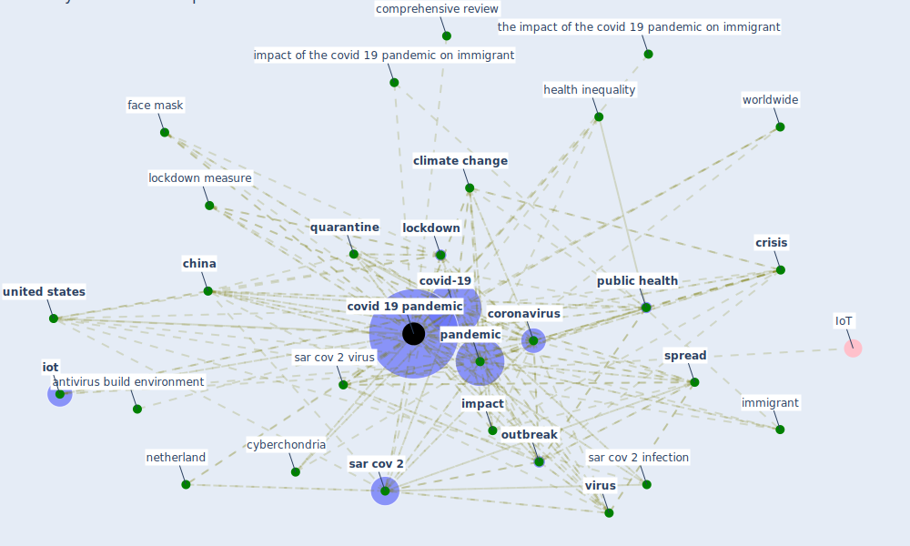

# Keyword: covid 19 pandemic

## Keywords

 * [5 g](keyword_5_g), a brave new world, antivirus build environment, [anxiety](keyword_anxiety), [artificial intelligence](keyword_artificial_intelligence), bangladesh, [blockchain](keyword_blockchain), [blockchain technology](keyword_blockchain_technology), [brazil](keyword_brazil), chicago, [china](keyword_china), [climate change](keyword_climate_change), climate crisis, community measure, comprehensive review, comprehensive review of the covid 19 pandemic, [confinement](keyword_confinement), [construction industry](keyword_construction_industry), [control](keyword_control), control it, [coronavirus](keyword_coronavirus), [covid 19 pandemic](keyword_covid_19_pandemic), [covid-19](keyword_covid-19), [crisis](keyword_crisis), current, [cyberchondria](keyword_cyberchondria), [danish](keyword_danish), [density](keyword_density), different phase, economic downturn, [epidemic](keyword_epidemic), [europe](keyword_europe), extreme event, face mask, first phase, [germany](keyword_germany), global, gupta, health inequality, [healthcare](keyword_healthcare), [hvac](keyword_hvac), hvac operation, [immigrant](keyword_immigrant), [impact](keyword_impact), impact of the covid 19 pandemic on immigrant, implication, [india](keyword_india), [infectious disease](keyword_infectious_disease), [iot](keyword_iot), italian, italian case study, [italy](keyword_italy), its impact, its implication, [japan](keyword_japan), kt platform, leave no country behind, [lockdown](keyword_lockdown), lockdown measure, [loneliness](keyword_loneliness), [malaysia](keyword_malaysia), mass vaccination, [netherland](keyword_netherland), [new york city](keyword_new_york_city), [outbreak](keyword_outbreak), [pandemic](keyword_pandemic), period of transition, philippine, [poland](keyword_poland), present, [public health](keyword_public_health), public health emergency, quarantine, recent history, recycle water, [sar cov 2](keyword_sar_cov_2), sar cov 2 infection, sar cov 2 virus, [saudi arabia](keyword_saudi_arabia), second wave, singapore, [smart city](keyword_smart_city), [south korea](keyword_south_korea), [spread](keyword_spread), startup in time of crisis, supply chain disruption, [telemedicine](keyword_telemedicine), the impact of the covid 19 pandemic on immigrant, transportation engineering, u s, [ug](keyword_ug), uncertainty, [united kingdom](keyword_united_kingdom), [united states](keyword_united_states), [vaccine](keyword_vaccine), [virus](keyword_virus), worldwide, [wtp](keyword_wtp), zhao, fighte

## Mapping

## Neighbours

### Closest articles

* A Comprehensive Review of the COVID-19 Pandemic and the Role of IoT, Drones, AI, Blockchain, and 5G in Managing its Impact - [LINK](article_chamola_comprehensive_2020)
* COVID-19 and Green Housing: A Review of Relevant Literature - [LINK](article_kaklauskas_covid-19_2021)
* A study on office workplace modification during the COVID-19 pandemic in The Netherlands - [LINK](article_hou_study_2021)
* How COVID-19 Could Accelerate the Adoption of New Retail Technologies and Enhance the (E-)Servicescape - [LINK](article_willems_how_2021)
* World Bank Development Report - [LINK](article_world_bank_world_2022)
* What has been the impact of the COVID-19 pandemic on immigrants? An update on recent evidence - [LINK](article_oecd_what_2022)
* COVID-19 Experience Transforming the Protective Environment of Office Buildings and Spaces - [LINK](article_phapant_covid-19_2021)
* The Role of Architecture and Urbanism in Preventing Pandemics - [LINK](article_kumar_role_2021)
* The impact of the COVID-19 pandemic on the importance of urban green spaces to the public - [LINK](article_noszczyk_impact_2022)
* Learning from the COVID-19 pandemic in governing smart cities - [LINK](article_bolivar_learning_2022)

### Closest BPs

